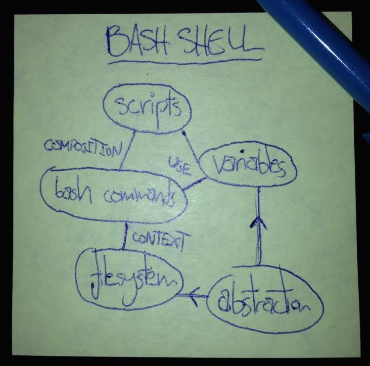

> ## Learning Objectives {.objectives}
>
> * FIXME

## A Cartoon of Knowledge

Two things are required to paint even the most elementary picture of knowledge:

 - *Ideas.* The core concepts themselves, like the filesystem, a command, or a variable.
 - *Connections* between ideas. The linkages that allow us to infer, construct lines of logic, and build functioning methodologies. A shell command is related to the filesystem, for example, via its executional context.

This representation of knowledge can easily be drawn as a graph; here's an example:

We can cast a useful abstraction of teaching & learning as the construction of these graphs of ideas and connections.

Often, teaching only recites the bubbles - presenting ideas without relating them to one another in a broader framework. This is perilous for students for a couple of reasons:

 - Short term memory only holds about 7 (ish) unrelated facts reliably.
Consider the number of digits in a phone number,
or the number of teammates concurrently on the field in most sports;
beyond about a half dozen things, it gets hard to keep track.
But if there are connections between objects, functional relationships and association can help reinforce knowledge.
For example, what's easier to remember: a list of a thousand random words, or the numbers one to one thousand?
 - Like it or not, students will form relationships between ideas -
but there's no guarantee they will independently come up with correct and useful relationships!
And it's these relationships that allow students to perform more sophisticated and operational tasks than facts alone.
If the relationships are wrong, their attempts to use their knowledge will fail.

In other words, structuring knowledge gives us a vehicle to reinforce memory,
and maximize its usability. In what follows, we'll explore a little about each.

[Exercise 1: Concept Maps, Part 1](http://mozillascience.github.io/instructorTraining/knowledgeAndExpertise/conceptMapping.html)

### Using Memory

Short term memory is the beachhead ideas find themselves on when they are first presented to students.
As mentioned above, its capacity is very small, and as the name suggests, it doesn't persist long.
How can we help shepherd information from short term into long term memory?

 - One key technique is called **chunking**. Short term memory can only handle about 7 facts at a time -
but what counts as a fact? Just as you recognize your name as your name and not a string of independent letters,
we can squeeze some extra capacity out of short term memory if we present information in patterns students can recognize.
Dr. Seuss was a master of this technique in teaching reading;
the real power of the doctor's writing was not so much in learning every word in the book,
but in assimilating the several phonetics patterns that made the text parsable for new readers.
In the same way, we interface with our students' short term memories better if all the things we say reinforce a small number of patterns and messages.
 - **Break your lesson up** as much as possible with questions and activities.
Traditional lecture style teaching for an hour or more often far exceeds the short term memories of the students subjected to it.
One of the elements of transferring information into long term memory is using it.
Ask your students to answer short problems, discuss what they've learned with their peers,
or respond to questions in order to get them to actively use their new knowledge.
Using knowledge to overcome challenges helps students build the connections in their concept maps that helps information persist,
and doing activities lets the students spend time cementing knowledge rather than listening to things they're going to forget.
 - **Live code**. Writing code live in front of your learners has several benefits:
     - The scale of code written live - probably no more than a few lines - matches the scale of short term memory better than instantly overwhelming them by popping a 200 line script onto the overhead.
     - Writing code live forces the instructor to slow down, lets students consider each element at a time, and match the patterns they've already seen.
     - Learners get to see our process; watching the instructor assemble a small piece of code illustrates those relationships on the concept map in real time.
     - Learners get to see us make mistakes. This is tangential to memory, but it is vital because it lets our students see that people they regard as professionals are not so different from themselves, and their own struggles make them equal to, rather than lesser than. Also, watching us recover from mistakes is a rare privilege - most teaching only steps through things working as they should, and does little to demonstrate recovery.

We can summarize these points in context with our concept map as follows:

 - Reinforce concepts by repetition and patterns
 - Reinforce connections by frequent exercises and activities
 - Regulate pace and scope of examples with live coding

### Using Structure

The key strengths of concept maps as opposed to point form notes is that they are operational, flexible, and more complete
in light of our graph model of knowledge. We can leverage these strengths in a number of ways:

 - **Operational**. By explicitly representing connections between ideas, constructing lines of logic becomes a trivial matter of connect the dots,
letting us construct lessons much more procedurally.
 - **Flexible**. Multiple paths between two ideas can be easily traced to construct sets of alternative explanations of concepts that are consistent and mutually reinforcing.
Also, densely connected subgraphs often emerge from larger graphs - these subgraphs naturally form individual lessons.
 - **Complete**. Because concept maps are a more complete representation of knowledge,
they provide diagnostic and reinforcing power:
     - At the end of a lesson, ask students to draw concept maps.
This will reveal their conceptual grasp of the lesson, so that you can react next time to any misconceptions this reveals.
This has the added benefit of making the students feel like the instructor actually cares to see if they learned anything - an important factor in motivation.
     - Some instructors like to draw concept maps for students while they lecture (not before).
The visual nature of these maps allow them to be received by learner's visual channel of learning;
a demonstrably independent channel from the linguistic one.
Giving students two channels to absorb information on can reinforce their understanding of each.
Pictures also serve as an 'external cache' for information,
that students can refer back to during the lesson to shore up their short term memory of things recently presented to them.

[Exercise 2: Concept Maps, Part 2](http://mozillascience.github.io/instructorTraining/knowledgeAndExpertise/conceptMapping.html)

Concpet maps have given us a practical tool for structuring content, systematizing teaching, and interfacing with memory.
They'll also help us get a handle on the second big question we started with in the introduction:
how can we understand the nature of competency, help our students achieve it, and distinguish it from mastery?

## What Makes a Master?

With the idea of concept maps in mind, we can begin to imagine the evolution of skill and knowledge as the growth of this graph.
In a simplification of Patricia Brenner's five-stage model of skill acquisition,
we can label some major milestones in that growth as novice, competent and master:

 - **Novices** have little or no mental model of the field;
they will struggle to relate to new information until that model is constructed.
Tasks completed, if any, can only be done strictly algorithmically by rote.
 - **Competent Practitioners** are familiar with most or all of the ideas relevant to the topic,
and are comfortable with the most important relationships between them.
They are able to complete a body of familiar tasks under regular conditions.
 - **Masters** may have little or no more ideas than competent practitioners,
but have many more and more subtle links between those ideas.
They are able to navigate highly novel challenges with approaches that do not rely on familiar pathways or patterns,
and leverage a wider array of opportunities.

This model informs more exactly what is involved in answering the second of our big questions,
on how to get our learners to a place of competence:

 - The right linkages between ideas have to be built; it is not enough to simply convey information.
Operational relationships not only reinforce memory, but make knowledge usable.
 - Too much raw information actually pushes learners back.
Without the right nodes on their graph to put new information in,
novices will often fail to group superficially different information together,
making the topic seem more complicated than it actually is,
or put information in entirely incorrect boxes,
creating misconceptions that have to be solved before progress can be made.

The most important transition we can help novice learners make,
is getting them over the model building hump. Once they have a basic functional model,
they can use it to assimilate new information quickly and correctly -
and this remains true beyond the classroom and the workshop.

Another upshot of this model is that it reveals why broadcast style lecturing often falls flat,
especially for novices; a novice busily stuffing facts into wrong boxes and making ill-concieved connections between them
is getting further from a functional understanding, rather than closer.
Novices need careful monitoring and interaction to make sure they aren't falling into conceptual traps.

The dense linkages of concepts that masters have also reveals why experts often struggle to teach in their fields;
with so many functional linkages, experts can jump along lines of logic no novice can follow.
Even when taking the time to go step by step,
there's no guarantee that the path followed by an expert will be natural or compelling for a novice
with very few options on how to get from A to Z.

Scientists don't really need to be master software engineers.
The novel problems that scientists encounter will almost entirely be in their fields of study - not in computing.
It therefore serves scientists best to be able to solve common problems in familiar circumstances -
the trademark of a competent practitioner.

Teaching, however, is in some sense always a novel problem.
Students will always come up with new ways to misunderstand things,
and so the flexibility afforded by mastery in teaching is always valuable.
How does one go about becoming a master?

The popular ten thousand hours number is certainly a myth.
Many people have driven for more than ten thousand hours,
and are little closer to mastery than after their driver's exam.
Something more than mere repetition is required.

Positing additional linkages between ideas is necessary but also not sufficient;
there needs to be some mechanism to scrutinize and validate those new links and the strategies that come out of them.

Musicians, athletes, actors and politicians have been doing it for years -
the key is simple feedback. By having a teacher or even a colleague observe and give constructive criticism that is specific and actionable,
we can iterate on our practice and get that invaluable second perspective on whether what we're doing is working,
and where it's falling short. In time, with enough criticism, we can begin to usefully criticise our own practice,
and this self-reflective criticism greatly accelerates the process of gaining mastery.
But to begin with, getting feedback from our colleagues starts the process.

[Exercise 3: Feedback Pt. 1](http://mozillascience.github.io/instructorTraining/knowledgeAndExpertise/feedback.html)

> ## FIXME {.challenge}
>
> FIXME
