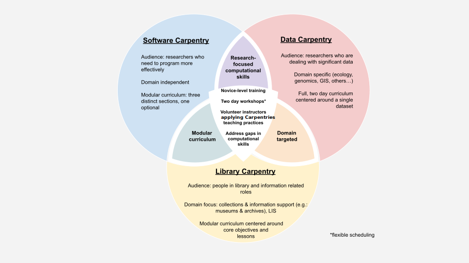

In becoming a certified [Carpentries Instructor](https://carpentries.org/instructors/),
you are also becoming part of a community of like-minded volunteers. Our most
active members draw upon this community for support and mentorship, pursuing goals that
matter to them and creating relationships across the globe.
This section provides some background on
[The Carpentries](https://carpentries.org/) organization, how we are structured, and a few
ways you might wish to participate (including by teaching workshops!).

::::::::::::::::::::::::::::::::::::::::::::::::::::::::::::::::::::: instructor

- CK: Not an "official" exercise, but after explaining the workshops and how to run them,
  go around the room, asking each person if they have a question + then answer them.

- Exercise: Creating a Workshop Website
  
  - CK: This takes some time, so some people opt to skip this section.  Inevitably,
    when working with a group of mixed experience with GitHub, some will be able
    to zip through this exercise, where others will struggle.  We **have** gotten
    positive feedback about this exercise as well, where learners felt like it was
    a valuable experience. Can be especially valuable for groups that will probably
    be running workshops on their own (so open trainings, or trainings for folks
    who are ready to get started right away).

- CK: The coffee break after this would be a great time for an "Ask and Offer" if the
  group is interested.

::::::::::::::::::::::::::::::::::::::::::::::::::::::::::::::::::::::::::::::::

::::::::::::::::::::::::::::::::::::::: objectives

- Get connected with The Carpentries community.
- Describe where you can go to get information on running a workshop.

::::::::::::::::::::::::::::::::::::::::::::::::::

:::::::::::::::::::::::::::::::::::::::: questions

- How is The Carpentries organised and run?
- What is the difference between SWC, DC, and LC workshops?
- How do you run a Carpentries workshop?

::::::::::::::::::::::::::::::::::::::::::::::::::

## A Brief History

[Software Carpentry](https://software-carpentry.org/) was founded in 1998 with the mission of teaching lab skills for research computing.
[Data Carpentry](https://datacarpentry.org/) was founded in 2014 with the mission of building communities teaching universal data literacy.

Also in 2014, [Library Carpentry](https://librarycarpentry.org/) was founded with the mission of teaching data skills to people working in library- and information-related roles.

On January 1, 2018, Software Carpentry and Data Carpentry merged to form a new project called
[The Carpentries](https://carpentries.org/)
under the fiscal sponsorship of
[Community Initiatives][CI].
Within this new organization structure, Software Carpentry and Data Carpentry retained their individual identities as Lesson Programs of The Carpentries.
On November 1, 2018, The Carpentries Executive Council
approved [Library Carpentry](https://librarycarpentry.org/)
as the third official Lesson Program of The Carpentries.

The Carpentries administration and other essential operations are held together by a small [Core Team][coreteam-page],
but the majority of our impact is achieved through the efforts of volunteer participants in our global and local communities.
The **global Carpentries community** consists of Instructors, Instructor Trainers, Maintainers, Lesson Developers, Institutional Partners, members of various committees, Executive Council
members, and other supporters who participate, synchronously or asynchronously, in building our programs for all to share. At the **local level**, individual
Carpentries communities may include many participants who are not necessarily connected with or even aware of our global activities, including helpers,
learners, faculty sponsors, and others who contribute to keep communities thriving and growing 'on the ground.'

{alt='A very brief history of The Carpentries. A timeline - 1998 Software Carpentry is founded by Greg Wilson and Bret Gorda to teach researchers better software development skills. 2005 lesson materials are made open source with support from the Python Software Foundation. 2012 Software Carpentry workshop efforts scale with support from the Alfred P. Sloan Foundation and the Mozila Science Lab. 2013 the first Software Carpentry for Librarians workshops are organised in the US and Canada. 2014 Data Carpentry is founded by Karen Cranston, Hilmar Lapp, Tracy Teal, and Ethan White with support from the National Science Foundation. James Baker receives support from the Software Sustainability Institute to develop and implement Library Carpentry. Software Carpentry Foundation is founded under the auspices of NumFOCUS. 2015 - Data Carpentry workshop efforts scaled with support from the Gordon and Betty Moore Foundation. 2018 in January, Software Carpentry and Data Carpentry merge to form The Carpentries, a fiscally sponsored project of Community Initiatives. In November, Library Carpentry joins as a Lesson Program.'}

You can learn more about the history and goals of each Lesson Program by reading
"[Software Carpentry: Lessons Learned][F1000]",
"[Data Carpentry: Workshops to Increase Data Literacy for Researchers][IJDC]" and
"[Library Carpentry: software skills training for library professionals][LIBERQ]"".

## Similarities and Differences between The Carpentries Lesson Programs

All lesson programs under The Carpentries share the same [core values][values-page].
Their aligned missions are accomplished by running accessible, inclusive training workshops; teaching openly available, high-quality, community-developed lessons; and fostering an active, inclusive, diverse instructor community that promotes and models reproducible research as a community norm.

Similarities between Data Carpentry, Library Carpentry, and Software Carpentry workshops include:

- a focus on technical skills,
- a two-day format taught by volunteer instructors, and
- a focus on filling gaps in current training for learners.

The major differences between Data Carpentry, Library Carpentry, and Software Carpentry workshops
are their content and intended audience. Their similarities and differences are depicted in this diagram:

{alt='Three intersecting circles labelled Software Carpentry, Data Carpentry, and Library Carpentry. Software and Data Carpentry both focus on research focused computational skills. Data and Library Carpentry are both domain targeted. Software and Library Carpentry both have modular a curriculum. All three Lesson Programs provide novice-level training, two-day workshops to address gaps in computational skills, taught by volunteer instructors applying Carpentries teaching practices.'}

## What is a Carpentries Workshop? The Rules.

### Using the Names and Logos

The names "Data Carpentry", "Library Carpentry", and "Software Carpentry"
and their respective logos
are all trademarked.
You may only call a workshop a Data Carpentry, Library Carpentry, or Software Carpentry workshop if it meets the requirements outlined on
[The Carpentries website][workshopsreq-page].

Note that as long as you have at least one certified Instructor, the other
instructors and helpers at a branded workshop do not have to be certified. We
rely on your judgement as a certified Instructor to recruit and orient volunteers who
will support you in implementing The Carpentries values and practices. **We do expect you to have at least one co-Instructor and helpers**, even if they are not
certified instructors.

:::::::::::::::::::::::::::::::::::::::::  callout

## Local Support

There is a helpful list for planning here in the handbook [Helper Checklist and Suggestions][docs-helper-checklist]. We recommend at least a 1:8
helper-to-learner ratio for in-person workshops and more (e.g. 1:5) if teaching online.

::::::::::::::::::::::::::::::::::::::::::::::::::

### Materials

All Carpentries lesson
materials are freely available under a permissive [open license](LICENSE.md).
This means that you may use them in contexts outside of a Carpentries workshop (e.g. as material
introduced into a longer course, as a standalone 2-3 hour session, as homework exercises, etc.)
provided you cite the original source.

It is only when you want to run a branded Carpentries workshop using the materials
that the workshop [requirements][workshopsreq-page] are in effect. Other workshops may be described as being "Carpentries-based", using Carpentries materials, etc.

### Reporting a 'Mix and Match' Workshop

If you do decide to self-organise a workshop of any length that does not fit the requirements of a lesson program but does draw from our officially recognized Data Carpentry,
Library Carpentry, or Software Carpentry lessons, we would still like to know about it! This helps us
to better evaluate our impact, and also to understand what the community wants and needs from our materials. You can report your "mix-and-match" workshop to us
(and take advantage of our pre- and post- assessment surveys!) by selecting "Register a self-organised workshop" on our [workshop request page][workshops-form].

At this time we are not seeking registration for lessons taught from The Carpentries Incubator or Carpentries Labs.

### Carpentries Jargon Review

As our community has evolved and its work has emerged, a vocabulary has built up around it. Many of the words we use have common meanings that are
interchangeable elsewhere, but have come to mean very specific things in our community.

:::::::::::::::::::::::::::::::::::::::  challenge

## Test yourself!

As a class or in groups, see how many of the following terms you can define.

- Lesson
- Episode
- Workshop
- Lesson Program
- Instructor
- (Instructor) Trainer

This should take about 5 minutes.

::::::::::::::::::::::::::::::::::::::::::::::::::

## How to Organise a Carpentries Workshop Locally

Briefly, there are two types of Carpentries workshops: **centrally-organised** and
**self-organised**. You can read (and hopefully have already read) about these on our [website][workshops-page].

Centrally organised workshops are included in institutional [membership][membership-page] packages and can also be requested separately for a fee. Since The Carpentries
will recruit Instructors to teach, this is a great way to host workshops before your local Instructor team feels fully prepared to run a complete workshop
independently, or to host workshops beyond the areas of expertise you may have locally.

If you have enough local Instructors available to organise your own workshop, you can run a self-organised workshop at any time at no cost.
If you would like to recruit additional Instructors or Helpers, [this blog post][SO-recruiting-blog] has guidelines for using Carpentries communications channels. Registering
your workshop with us allows you to use The Carpentries branding, includes our pre- and post- workshop surveys and results for your workshop, and ensures
that all Instructors and Helpers in our database have the experience recorded in their profile. Registering your workshop also helps us: reporting
on our global impact is vital to our future funding opportunities, allowing us to continue to provide and develop materials and opportunities for you.

Once you have selected your workshop type, consult [**The Carpentries Handbook**][docs] for more resources to support your organising effort.
The Carpentries Handbook is the definitive source for policies and information, including tips, checklists, and points of contact for nearly all
Carpentries-related activities. A few examples of useful content include:

- template emails and checklists for Hosts, Instructors, and Helpers in [The Carpentries Handbook: Teaching and Hosting][docs-teach-host]
- [policies][docs-policies], many of which affect Instructors and workshops, including
- the [instructor no-show policy][docs-noshow] which is important to read before signing up for your first workshop

As The Carpentries grows and changes in response to a complex global legal landscape, our policies and procedures are likely to change. Be sure to check
back for policy changes, and keep in touch on our [communications channels][connect-page] to stay abreast of the latest updates!

:::::::::::::::::::::::::::::::::::::::::  callout

## Teaching Opportunities: Local and Global

Many Instructors aim to teach within a local community and do not want to travel. In that case,
you will coordinate with your community to gain access to teaching opportunities through locally organised workshops.

If you want to be presented with opportunities to teach outside your community -- locally or far from home, be sure to join our [Instructors
mailing list][instructors-list]. This is how we recruit Instructors to teach in centrally-organised workshops around the world.

The Carpentries can not guarantee
that all Instructors who respond to recruitment calls will be selected, and depending on your area these opportunities may be scarce.
If you want to get started right away, consider organizing
your own workshop or even teaching a single lesson with a few friends. If your friends have not been through Instructor Training,
you will need to set aside some time to help them understand how best to support your efforts.

::::::::::::::::::::::::::::::::::::::::::::::::::

:::::::::::::::::::::::::::::::::::::::  challenge

## Explain to a partner

With a partner, take turns asking and answering the question: "I want to organize a workshop! What will I need to do?" One partner should ask about a
self-organised workshop, and the other can ask about a centrally-organised workshop. If you have a third person, they can help out with follow-up questions
or answers as needed.

When you encounter new questions during this process, be sure to write them in the Etherpad.

Leave about 10 minutes for this discussion.

::::::::::::::::::::::::::::::::::::::::::::::::::

## Setting Out On Your Own... Together: Lesson Incubation

Maybe this instructor training has inspired you to go home and write your
own fantastic lesson!  If you would like to model it after the Software, Data and
Library Carpentry lesson format, you can find a template and instructions in
[The Carpentries lesson example repository](https://github.com/carpentries/lesson-example/),
and a place to develop it in [The Carpentries Incubator][carpentries-incubator].

Any lesson that uses The Carpentries [lesson template][lesson-template],
follows our [Code of Conduct][coc], and is licensed either [CC-BY][cc-by] or [CC-0][cc-0]
can be hosted in The Carpentries Incubator.
Another resource, [The Carpentries Curriculum Development Handbook][cdh], provides a guide to
the backwards design approach we recommend for lesson development.

## A Culture of Contribution

In the same way that we hope to promote research practices that are open, collaborative,
and reproducible through our technical trainings, The
Carpentries community aims to embody a culture of openness, sharing, and
continual pursuit of best practices. We draw together the collective expertise of
all who join us to collaborate on new lessons, share resources,
and maintain our lessons with small and large fixes and improvements as we go.

When you join our community by contributing, you join an amazing group of people. Whether you are contributing
through our repositories, communications channels, or by joining a meeting or taking on a role, you will find
other people like you who care about The Carpentries [core values][values-page] and want to make a difference. Your efforts,
small and large, will combine with theirs to make the work of this organisation possible.

Whatever your interests or strengths, we hope you will find a place where you can grow with us!

:::::::::::::::::::::::::::::::::::::::  challenge

## Community Roles

Select one role from the list below that interests you. Using the the descriptions on [The Carpentries community website][community-page], write

1) a short definition of the role and 2) a question that you have (or that you imagine someone else might have) about the role. Are there roles you
  would like to see that are not listed? Note that, too!

1. Executive Council
2. Mentors
3. Instructor Trainers
4. Lesson Developers
5. Code of Conduct Committee
6. Instructor Development Committee
7. Community Facilitators
8. Maintainers

This exercise should take about 5 minutes.

::::::::::::::::::::::::::::::::::::::::::::::::::

### Keeping In Touch

There are a dizzying number of ways to listen and communicate with The Carpentries communities. It is not necessary to follow all of them! Everyone has their own favorite
ways to keep in touch, and we do our best to make that possible.

Want to **listen**?

- Sign up for our newsletter
- Follow us on Twitter, Facebook, or LinkedIn

Want to **interact** (or listen with options to engage)?

- Join our Slack organisation
- Join our Email lists (start with "Discuss"!)

Want to **join meetings** (to meet new people or listen in)?

- Sign up for Community Discussions (or just drop in if there is space!) or other events when announced
- Explore taking on one of the Roles identified above

:::::::::::::::::::::::::::::::::::::::  challenge

## Get Connected

Take a couple of minutes to sign up for The Carpentries channels you want to stay involved with on this page:
[https://carpentries.org/connect/][connect-page]
When you are done, share a channel you find interesting or useful on the Etherpad.

This exercise should take about 5 minutes.

::::::::::::::::::::::::::::::::::::::::::::::::::

:::::::::::::::::::::::::::::::::::::::: keypoints

- The Carpentries materials are all openly licensed, but names and logos are trademarked.
- Carpentries workshops must cover core concepts, have at least one certified Instructor, and use our pre- and post-workshop surveys.
- [Guidance for teaching and hosting workshops][docs-teach-host] is provided in [The Carpentries Handbook](https://docs.carpentries.org).

::::::::::::::::::::::::::::::::::::::::::::::::::

[CI]: https://communityin.org/
[coreteam-page]: https://carpentries.org/team/
[F1000]: https://f1000research.com/articles/3-62/v2
[IJDC]: https://ijdc.net/index.php/ijdc/article/view/10.1.135
[LIBERQ]: https://www.liberquarterly.eu/article/10.18352/lq.10176/
[values-page]: https://carpentries.org/values/
[workshopsreq-page]: https://carpentries.org/workshops/#workshop-core
[docs-helper-checklist]: https://docs.carpentries.org/topic_folders/hosts_instructors/hosts_instructors_checklist.html#helper-checklist
[workshops-form]: https://amy.carpentries.org/forms/workshop/
[workshops-page]: https://carpentries.org/workshops/#workshop-organising
[membership-page]: https://carpentries.org/membership/
[SO-recruiting-blog]: https://carpentries.org/blog/2021/06/Recruiting-Instructors-for-Self-Organised-Workshops/
[docs]: https://docs.carpentries.org/
[docs-teach-host]: https://docs.carpentries.org/topic_folders/hosts_instructors/index.html
[docs-policies]: https://docs.carpentries.org/topic_folders/policies/index.html
[docs-noshow]: https://docs.carpentries.org/topic_folders/policies/instructor-no-show-policy.html#instructor-no-show-policy
[connect-page]: https://carpentries.org/connect/
[instructors-list]: https://carpentries.topicbox.com/groups/instructors
[carpentries-incubator]: https://github.com/carpentries-incubator/proposals/
[lesson-template]: https://carpentries.github.io/lesson-example/
[coc]: https://docs.carpentries.org/topic_folders/policies/code-of-conduct.html#code-of-conduct-summary-view
[cc-by]: https://creativecommons.org/licenses/by/4.0/
[cc-0]: https://creativecommons.org/share-your-work/public-domain/cc0/
[cdh]: https://cdh.carpentries.org/
[community-page]: https://carpentries.org/community/

