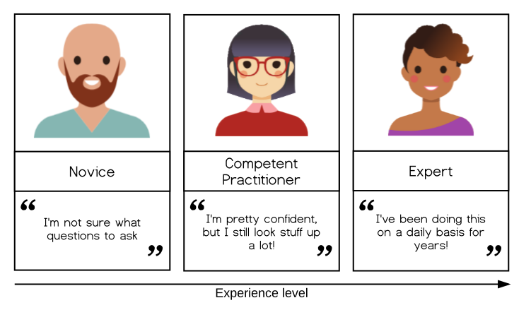
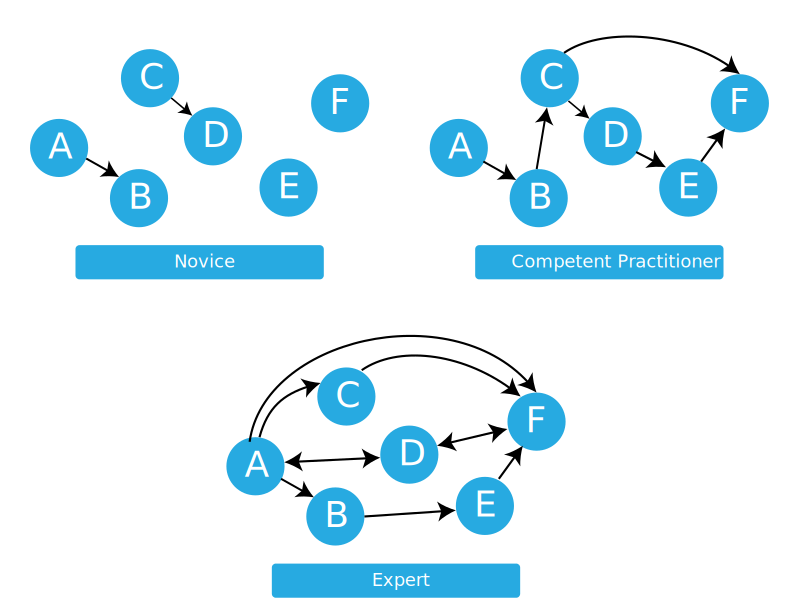

We'll now get started with a discussion of how learning works. We'll learn
some key findings from educational research and identify how these principles
are put into practice in Carpentry workshops.

## The Carpentries Pedagogical Model

The Carpentries aims to teach computational competence to learners. We take an applied approach, avoiding the theoretical and general
in favor of the practical and specific. By showing learners how to solve specific problems with specific tools and providing hands-on
practice, we develop learners' confidence and lay the foundation for future learning.

A critical component of this process is that learners are able to practice what they are learning in real time, get
feedback on what they are doing, and then apply those lessons learned to the next step in the learning process. Having
learners help each other during the workshops also helps to reinforce concepts taught during the workshops.

A Carpentries workshop is an interactive event -- for learners and instructors. We give and
receive feedback throughout the course of a workshop. We incorporate assessments within the lesson materials and
ask for feedback on sticky notes during lunch breaks and at the end of each day. In this way, instructors can adjust the
pace and content of a workshop to meet the needs of the learners in that group, as well as collect feedback
that will help us improve lesson materials or methodology for future workshops. Instructors and helpers also provide
feedback to learners throughout workshops in order to get them unstuck or provide a greater depth of understanding about
the materials. Interacting in this way with the learners helps us determine how they are doing and figure out what concepts
people are having trouble with or where we might be able to move along more quickly.

## The Acquisition of Skill

Our approach is based on the work of researchers like Patricia Benner,
who applied the [Dreyfus model of skill acquisition][wikipedia-dreyfus-skill]
in her studies of
[how nurses progress from novice to expert](http://journals.sagepub.com/doi/10.1177/0270467604265061)
([see also books by Benner](https://www.worldcat.org/search?q=au%3ABenner%2C+Patricia+E.&qt=hot_author)). This work indicates that
through practice and formal instruction, learners acquire skills and advance through distinct stages. In simplified form,
the three stages of this model are:

*   *Novice*: someone who doesn't know what they don't know, i.e.,
    they don't yet know what the key ideas in the domain are or how they relate.
    One sign that someone is a novice is that their questions "aren't even wrong".

    > Example: A *novice* learner in a Carpentries workshop might never have heard of the bash shell, and therefore
    may have no understanding of how it relates to their file system or other programs on their computer.

*   *Competent practitioner*: someone who has enough understanding for everyday purposes. They won't know all the details
of how something works and their understanding may not be entirely accurate, but it is sufficient for completing normal
tasks with normal effort under normal circumstances.

    > Example: A *competent practitioner* in a Carpentries workshop might have used the shell before and understand how to
    move around directories and use individual programs, but they might not understand how they can fit these programs
    together to build scripts and automate large tasks.

*   *Expert*: someone who can easily handle situations that are out of the ordinary.

    > Example: An *expert* in a Carpentries workshop may have experience writing and running shell scripts and, when
    presented with a problem, immediately sees how these skills can be used to solve the problem.

For now, we are primarily concerned with novices,
as this tends to characterize the Carpentries audience. (We, as instructors,
  are more likely to be competent practitioners or experts, and we'll
discuss this in a later section).  We'll next use an additional concept
to help us differentiate between novices and competent practitioners, which will have
implications for how we teach novices.

## Cognitive Development and Mental Models

Effective learning is facilitated by the creation of a well-founded mental model. A mental model is a collection of concepts and facts,
along with the relationships between those concepts, which a person has about a topic. For example, a long-time resident of the United
States may have an advanced understanding of the location of US states, major cities and landmarks, weather patterns, regional
economies and demographic patterns, as well as the relationships among these, compared with their understanding of these relationships
for other countries. In other words, their mental model of the United States is more complex compared with their mental model of other
countries.

We can distinguish between a *novice* and a *competent
practitioner* for a given domain based on the complexity of their mental models.

*     A *novice* is someone who has not yet built a mental model of the domain.
They therefore reason by analogy and guesswork,
borrowing bits and pieces of their mental models of other domains
which seem superficially similar.
*     A *competent practitioner* is someone who has a mental model that's good enough for everyday purposes. This model
does not have to be completely accurate in order to be useful:
for example, the average driver's mental model of how a car works probably doesn't include
most of the complexities that a mechanical engineer would be concerned with.

We will discuss the mental models of experts in more detail in [a later lesson]({{ page.root }}/03-expertise/).

> ## Your Mental Models
>
> In the Etherpad, write your primary research domain or area of expertise and some aspects of the mental model you use to frame
> and understand your work. What concepts/facts are included? What types of relationships are included?
>  
> This discussion should take about 5 minutes.
{: .challenge}

One key insight from research on cognitive development is that
novices, competent practitioners, and experts each need to be taught differently.
In particular,
presenting novices with a pile of facts early on is counter-productive,
because they don't yet have a model or framework to fit those facts into.
In fact,
presenting too many facts too soon can actually reinforce
an incorrect mental model.

Most learners coming to Carpentries lessons are novices,
and do not have a strong mental model of the concepts we are teaching.
Thus, our primary goal is *not*
to teach the syntax of a particular programming language, but *to help them construct a working mental model*
so that they have something to attach facts to. In other words, our goal is to teach people *how to think* about programming and data
management in a way that will allow them to learn more on their own or understand what they might find online.

### The Importance of Going Slowly

> If someone feels it's too slow, they'll be a bit bored. If they feel it's too fast, they'll never come back to programming.
> — Kunal Marwaha, SWC instructor
{: .quotation}

If our goal is to help novices construct an accurate and useful mental model of a new intellectual domain,
this will impact our teaching. For example, we principally want to help learners
form the right categories and make connections among concepts.  We *don't*
want to overload them with a slew of unrelated facts, as this will be confusing.

An important practical implication of this latter point is the pace at which we teach.  
In the first main episode of Software Carpentry's [lesson on the Unix shell][swc-shell-novice],
which covers "Navigating Files and Directories", there are only four "commands"
for 40 minutes of teaching. Ten minutes per command may seem glacially slow,
but that episodes's real purpose is to teach learners about paths; later on,
they will learn about history, wildcards, pipes and filters,
command-line arguments, redirection,
and all the other big ideas on which the shell depends,
and without which people cannot understand how to use commands.

That mental model of the shell also includes things like:

*   Anything you repeat manually, you'll eventually get wrong
    (so let the computer repeat things for you by using tab completion
    and the `history` command).
*   Lots of little tools, combined as needed, are more productive than
    a handful of programs.
    (This motivates the pipe-and-filter model.)

These two examples illustrate something else as well.
Learning consists of more than "just" building mental models
and adding information to them;
creating linkages between concepts and facts is at least as important.
Telling people that they shouldn't repeat things,
and that they should try to think in terms of little pieces loosely joined,
both set the stage for discussing functions.
Explicitly referring back to pipes and filters in the shell when introducing functions
helps solidify both ideas.

> ## Meeting Learners Where They Are
> One of the strengths of Carpentry workshops is that we meet learners where they're at. Carpentry instructors
> strive to help learners
> progress from whatever starting point they happen to be at, without making anyone
> feel inferior about their current practices or skillsets. We do this in part by teaching relevant and useful skills
> building an inclusive learning environment, and continually getting (and paying attention to!) feedback
> from learners. We'll be talking in more depth about each of these strategies as we go forward in our workshop.
{: .callout}

## How "Knowledge" Gets in the Way

Besides going slowly, what else can we do to facilitate the formation of
sufficiently accurate mental models? One important action is to address the
misconceptions of broken mental models.

Mental models are hardly ever built from scratch. Every learner comes to a topic
with some amount of information, ideas and opinions about the topic. This is true even
in the case where a learner can't articulate their prior knowledge and beliefs.  

In many cases, this prior knowledge is incomplete or inaccurate. Inaccurate beliefs can be termed "misconceptions" and
can impede learning by making it more difficult for learners to incorporate new, correct information into their mental
models.
Correcting learners' misconceptions is at least as important as presenting them with correct information.
Broadly speaking, misconceptions fall into three categories:

*   Simple *factual errors*, such as believing that Vancouver is the capital of British Columbia.
    These are the easiest to correct.
*   *Broken models*, such as believing that motion and acceleration must be in the same direction.
    We can address these by having learners reason through examples to see contradictions.
*   *Fundamental beliefs*,
    such as "the world is only a few thousand years old"
    or "human beings cannot affect the planet's climate".
    These beliefs are deeply connected to the learner's social identity
    and are the hardest to change.

Since the Carpentries workshops are focused on novices, and the building of
strong mental models, we're most interested in the middle category of misconceptions.
While teaching, we want to expose learners' broken models so that we can help them build better ones.

## Identifying and Correcting Misconceptions

How do we expose misconceptions, especially as they pertain to broken models? How
can we, in-class, know whether the learners already understand this topic
(so that the class can move on),
and if not,
what misconceptions and gaps in their knowledge we should address.

To be effective, instructors need feedback on their learners' progress,
and insight into their learners' mental models.
This feedback comes through what we call *formative assessments* (in contrast
  to *summative assessment*).

> ## Summative Assessment
> *Summative assessment* is used
> to judge whether a learner has reached an acceptable level of competence.
> Learners either "pass" or "fail" a summative assessment.
> One example is a driving exam,
> which tells the rest of society whether someone can safely be allowed on the road. Most assessment done in university
> courses is summative, and is used to assign course grades.
{: .callout}

*Formative assessment* takes place during teaching and learning. It sounds like
a fancy term, but it can be used to describe any interaction or activity
that provides feedback to both instructors and learners about learners' level of understanding of the
material. For learners, this feedback can help focus their study efforts. For instructors, it allows them to refocus
their instruction to respond to challenges that learners are facing.  

Learners don't "pass" or "fail" formative assessments; they are simply a feedback mechanism.
For example, a music teacher might ask a learner to play a scale very slowly
in order to see whether they are breathing correctly,
and if not, what they should change.

Formative assessment is most useful when it happens frequently (we'll talk about how frequently later) and when the
results are easily interpretable by the learner and instructor.

> ## Repetition vs. Reflective Practice
>
> The idea that ten thousand hours of practice will make someone an expert in some field
> is widely known,
> but reality is much more complex.
> Practice is not doing the same thing over and over again:
> practice is doing similar but subtly different things,
> getting feedback,
> and then changing behavior in response to that feedback to get cumulatively better.
> Doing the same thing over and over again is much more likely to solidify bad habits than perfect performance.
> This is why we emphasize practice and feedback for learners at our workshops and for trainees in our
> instructor training program.
{: .callout}

## Formative Assessments Come in Many Forms

There are many types of formative assessment, and each have their advantages and disadvantages.

> ## Formative Assessments
>
> Based on your previous educational experience (or even this training so far!)
> what types of formative assessments do you know about?
>
> Write your answers in the etherpad; or go around and have each person in the group name one.
{: .challenge}

One example of formative assessment that we would like to highlight is
the multiple choice question (MCQ).
When designed well,
these can do much more than just measure how much someone knows.
For example,
suppose we are teaching children multi-digit addition.
A well-designed MCQ would be:

~~~
Q: what is 27 + 15 ?
a) 42
b) 32
c) 312
d) 33
~~~
{: .source}

The correct answer is 42,
but each of the other answers provides valuable insight.

> ## Identify the Misconceptions
>
> Choose one wrong answer and write in the Etherpad what the misconception is associated with that wrong answer.
> This discussion should take about 10 minutes.
>
>> ## Solution
>>
>> *   If the child answers 32, they are throwing away the carry completely.
>> *   If they answer 312, they know that they can't just discard the carried '1',
>>     but doesn't understand that it's actually a ten
>>     and needs to be added into the next column.
>>     In other words,
>>     they are treating each column of numbers as unconnected to its neighbors.
>> *   If they answer 33 then they know they have to carry the 1,
>>     but are carrying it back into the same column it came from.
> {: .solution}
{: .challenge}

Each of these incorrect answers is a *plausible distractor* with *diagnostic power*.
"Plausible" means that it looks like it could be right:
instructors will often put supposedly-silly answers like "a fish!" on MCQs,
but (a) they don't provide any insight
and (b) learners actually don't find them funny.
"Diagnostic power" means that each of the distractors helps the instructor figure out
what concepts learners are having difficulty with.  

Formative assessments are most powerful when an instructor modifies their instruction depending on the
results of the assessment. An instructor may learn they need to change their pace or review a particular concept.
Knowing how to respond to the results of a formative assessment is a skill that you will develop over time.

> ## Handling Outcomes
>
> Formative assessments allow us as instructors to adapt our instruction to our audience.
> What should we do as instructors if the class chooses:
>
> 1. mostly one of the wrong answers?  
> 2. mostly the right answer?  
> 3. an even spread among options?
>
> For one of the above, enter your answer in the Etherpad.   
>
> This discussion should take about 5 minutes.
>
>> ## Solution
>> 1. If the majority of the class votes for a single wrong answer, you should go back
>> and work on correcting that particular misconception.  
>> 2. If most of the class votes
>> for the right answer, it's probably safe to move on.  
>> 3. If answers are pretty evenly
>> split between options, learners are probably guessing randomly and it's a good
>> idea to go back to a point where everyone was on the same page.
> {: .solution}
{: .challenge}

> ## Modeling Novice Mental Models
>
> Take 10 minutes to create a multiple choice question related to a topic you intend to teach.
> Type it into the Etherpad
> and explain the diagnostic power of each its distractors,
> i.e., what misconception is each distractor meant to identify?
{: .challenge}

> ## A Note on MCQ Design
>
> *   A good MCQ tests for conceptual misunderstanding rather than simple factual knowledge.
>     If you are having a hard time coming up with diagnostic distractors,
>     then either you need to think more about your learners' mental models,
>     or your question simply isn't a good starting point for an MCQ.
> *   When you are trying to come up with distractors,
>     think about questions that learners asked or problems they had
>     the last time you taught this subject.
>     If you haven't taught it before,
>     think about your own misconceptions
>     or ask colleagues about their experiences.
{: .callout}

Designing an MCQ with plausible distractors is useful
even if it is never used in class
because it forces the instructor to think about the learners' mental models
and how they might be broken---in short,
to put themselves into the learners' heads
and see the topic from their point of view.

There are many types of formative assessments other than MCQs. One (non-exhaustive) list
to supplement the earlier exercise
can be found in the [Edutopia assessment group](https://www.edutopia.org/groups/assessment/250941).

## Formative Assessments Should Be Frequent

Instructors should use a formative assessment ideally every 5 minutes and
at least every 10-15 minutes
in order to make sure that the class is actually learning.
Since the average attention span is usually only this long,
formative assessments also help break up instructional time
and re-focus attention.
Formative assessments can also be used preemptively:
if you start a class with a question and everyone can answer it correctly,
then you can safely skip the part of the lecture
in which you were going to explain something that your learners already know.

> ## How Many?
>
> The Carpentries use formative assessments often. How many have we done since the start of this
> workshop? Put your guess in the Etherpad along with one example and the purpose that assessment served.  
>
> This discussion should take about 5 minutes.
>
>> ## Solution
>> This will depend on the event they are attending. Most attendees will guess low.
>> The purpose of this exercise is to emphasize the importance of frequent formative
>> assessments and that an individual assessment doesn't have to take a lot of time.
> {: .solution}
{: .challenge}

> ## A Corollary Regarding Novices
>
> Learners are commonly _far_ too satisfied to not understand key points
> and remain confused.  If learners remain confused, they are far less likely
> to adopt our "good enough" practices at the conclusion of the workshop.
> Encourage helpers to support confused learners as far as possible within
> the flow of the workshop.
{: .callout}

## Optional exercises

> ## Confronting the Contradiction
>
> Describe a misconception you have encountered in your own learning or teaching
> and how to get learners to confront it.
{: .challenge}

[swc-shell-novice]: http://swcarpentry.github.io/shell-novice/
[wikipedia-dreyfus-skill]: https://en.wikipedia.org/wiki/Dreyfus_model_of_skill_acquisition
