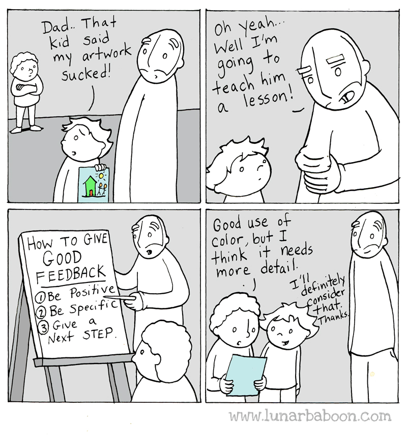

So far, we've focused on how we can be effective instructors by understanding
how people learn and how to create a positive classroom environment, covering
two of our primary goals in helping you become a certified Carpentries instructor.
Now our focus will shift to developing additional teaching skills that you can
use in a Carpentries workshop setting, starting with the process of "lesson study",
or teaching observation and feedback.

## Lesson Study: Applying a Growth Mindset to Teaching

We've seen that providing opportunities for practice
and giving useful feedback to learners are essential components in the learning
process. Learning to teach is no different.

However, many people assume that teachers are born, not made.  From politicians
to researchers and teachers themselves, most reformers have designed systems to
find and promote those who can teach and eliminate those who can't.
As Elizabeth Green describes in *[Building a Better Teacher][worldcat-babt]*, though,
that assumption is wrong, which is why educational reforms based on it have repeatedly failed.

To assume that teaching is an "inherited" or innate skill is to take on a fixed
mindset about teaching. A growth mindset believes that anyone can become a better
teacher by the same methods we use to learn any subject -- reflective practice.
More specifically, instructors develop teaching skill
over time through practice and improve most when given feedback on their performance
from other instructors who share their pedagogical model.

We know that teachers can learn how to teach because of research done on
the Japanese method of jugyokenkyu or "lesson study."

In the 1980s and 90s, an educational psychologist named James Stigler observed
teachers in the US and Japan. In the [OECD's annual rankings][oecd-pisa] of countries' educational
achievements, Japanese students routinely test near the top in reading, math and science, while
American students rank at or below average.

Looking at differences in teaching methods, Stigler found that American teachers met at most once
a year to exchange ideas about teaching, compared to the weekly or even daily meetings of Japanese
teachers. During these meetings, teachers in the US described their lessons to each other, but they did
not observe each others' teaching in practice. In contrast, Japanese teachers regularly conducted lesson study:
observing each other at work, discussing the lesson afterward, and studying curriculum materials with their
colleagues.

The situation is different in many English-language school systems:
in the US, Canada, the UK, Australia, and elsewhere, where often
what happens in the classroom stays in the classroom.
Teachers aren't able to watch each other's lessons on a regular basis,
so they can't borrow each other's good ideas.
The result is that *every teacher has to invent teaching on their own*.
They may get lesson plans and assignments from colleagues,
the school board,
a textbook publisher,
or the Internet,
but each teacher has to figure out on their own how to combine that with
the theory they've learned in their educational programs
to deliver an actual lesson in an actual classroom for actual learners.
When teachers don't observe each other teaching, the tricks and techniques that each instructor
has painstakingly incorporated into their practice don't have the opportunity to spread, limiting
forward momentum on system-wide improvements to teaching.

> ## Reading It Isn't Enough
> Several research studies (in [2007][fincher-warren], [2012][fincher-stories], and [2015][barker-practice]) have shown
> that teachers don't adopt instructional practices based on reports about the effectiveness of those practices.
> Social norms, institutional
> culture, and lack of time and support prevent many teachers from moving out of
> their accustomed teaching habits. Change in teaching doesn't come about through reading about new teaching practices, but by seeing
> these practices in action, practicing them and getting feedback from other instructors.
{: .callout}

Therefore, just like other disciplines (sports and music are two good examples), teachers benefit from closely
observing the work of others.  The Carpentries pedagogical model supports lesson
study by providing many opportunities for our instructors
to learn from each other. In this training workshop, you will have opportunities to practice teaching for one another
and to give each other feedback.  You'll also have the opportunity to practice in front of an experienced instructor
as part of your instructor training checkout. In addition, Carpentries instructors always teach in pairs (or more),
giving you the opportunity to learn by observing and to get feedback from your fellow instructors.

> ## Giving Feedback
>
> We'll start by observing some examples of teaching and providing some feedback.
>
> Watch this [example teaching video][bad-teaching-video] as a group
> and then give feedback on it. Put your feedback in the Etherpad.
> Organize your feedback along two axes:
> positive vs. negative
> and content (what was said) vs. presentation (how it was said).
> This exercise should take about 10 minutes.
{: .challenge}

Now that you've had some practice observing teaching and giving feedback, let's practice with each other.

> ## Feedback on Yourself
>
> The goal of this exercise is to practice giving and receiving feedback, so don't be
> overly concerned about creating a perfectly polished presentation.
> We don't give you a lot of time to prep and the teaching time is short, so embrace
> the challenge (and improvisation) of the exercise and see what you can learn by
> watching other people teach, thinking about how to give them feedback, and how it
> feels to get feedback on your own teaching.
>
> **Trainings where trainees are co-located:**
> 1.  Split into groups of three.
> 2.  Individually, spend 5 minutes preparing to teach a 90-second segment of
>     the lesson episode you chose before the start of the training course. You will not
>     be live coding; you can use a whiteboard or other visual aids if available (but
>     this is not required!). We recommend using this 90 second teaching moment
>     to introduce the topic of your lesson.
> 3.  Get together with your group and have each person teach their segment to the group,
>     while one person records this (video and audio)
>     using a cell phone or some other handheld device.
>     Keep a strict time limit of 90 seconds per person (one person
>     should be responsible for the timekeeping).
> 3.  After the first person finishes,
>     rotate roles
>     (they become the videographer,
>     the audience becomes the instructor,
>     the person who was recording becomes the audience)
>     and then rotate roles again.
> 4.  After everyone in the group of three has finished teaching,
>     watch the videos as a group.
>     Everyone gives feedback on all three videos,
>     i.e., people give feedback on themselves as well as on others.
> 5.  After everyone has given feedback on all of the videos,
>     return to the main group and put everyone's feedback about you into the Etherpad.
>
> **Distributed trainings:**
> Your Trainer will split the group into virtual break-out rooms. Follow the instructions above
> but do not record each other. Instead, give each person feedback immediately after they finish their
> turn teaching. Also with in this setup one person should be responsible for the timekeeping.
>
> This exercise should take about 25 minutes.
{: .challenge}

## Feedback Is Hard

Sometimes it can be hard to receive feedback, especially negative feedback.

Feedback is most effective when the people involved
share ground rules and expectations. In Carpentries teaching, we use the 2x2
paradigm for feedback. Each person giving feedback is expected to provide at least one
piece of negative and one piece of positive feedback each for content and delivery. This
helps overcome two common tendencies when giving feedback on teaching: to focus on the content
(even though delivery is at least as important) and to either provide only negative or
only positive feedback.

Here is a list of different
ways that you can set the stage for receiving or providing feedback
in a way that facilitates growth.

*   Initiate feedback as the instructor. It's better to ask for feedback than to receive it unwillingly.

*   Ask for and give specific feedback. See a great example of this from
  this Lunar Baboon comic: 

  As an instructor one way to get specific feedback is to provide questions that
  focus the responses.  Writing your own feedback questions allows you to frame
  feedback in a way that is helpful to you - the questions below
  reveal what didn't work in your teaching, but read as professional suggestions rather than personal judgments.
  For example:
  
* "What is one thing I could have done as an instructor to make this lesson more effective?"
* "If you could pick one thing from the lesson to go over again, what would it be?"

* Balance positive and negative feedback.
    * Ask for or give "compliment sandwiches" (one positive, one negative, one positive)
    * Ask for both types of feedback, and give both types.

* When sharing negative feedback, provide a clear next step to follow that will help the recipient improve.

* Communicate expectations. If your teaching feedback is taking the form of an
  observation (and you're comfortable enough with the observer), tell
  that person how they can best communicate their feedback to you.

* When giving feedback, remember that giving and receiving feedback is a skill that requires practice, so don't
be frustrated if your feedback is rejected but try to think about why the recipient might not have been comfortable
with the feedback you gave.

* Use a feedback translator.  Have a fellow
  instructor (or other trusted person in the room) read over all the feedback and give
  an executive summary.   It can be easier to hear "It sounds like most people
  are following, so you could speed up" than to read several notes all saying, "this is
  too slow" or "this is boring".

This is part of the reason for the Carpentries' rule,
"Never teach alone."
Having another instructor in the classroom saves your voice
(it's hard to talk for two days straight),
but more importantly,
it's a chance for instructors to learn from one another and be a supportive voice
in the room.

Finally, be kind to yourself. If you're a self-critical person,
it's OK to remind yourself:

*   The feedback isn't personal.
*   There are always positives along with the negatives.

> ## Feedback on Feedback (Optional)
>
> Watch either this [scipy tutorial][scipy-video-1] (8:40)
> or this [other tutorial][scipy-video-2] (11:42).
> For each, give feedback following the 2x2
> model. Put your feedback in the Etherpad.
>
> This exercise and discussion should take about 15 minutes.
{: .challenge}

> ## Using Feedback
>
> Look back at the feedback you received on your teaching in an earlier exercise.
> How do you feel about this feedback? Is it fair and reasonable? Do you agree with it?
>
> Identify at least one specific change you will make to your teaching based on this feedback.
> Describe your change in the Etherpad.
>
> This exercise should take about 5 minutes.
{: .challenge}

Hopefully you were able to identify at least one helpful comment in the feedback you received and are able to
use it to start (or continue) the process of improving your teaching. Remember, teaching is a skill that is learned.
If you notice yourself feeling hurt or threatened by the feedback you got, or rejecting it as unfair or wrong,
pause and try to consider the feedback from a growth mindset - that through practice and feedback, your skills
are going to improve. By strengthening your growth mindset with respect to teaching, you can
transform getting feedback from an unpleasant experience to a richly rewarding one. You'll have more opportunities to
practice teaching and to get and give feedback tomorrow.

## Optional Exercises

> ## Skill Acquisition: What level are your teaching skills?
>
> As with computational skills, people have a tendency to think of teaching as something you are "just good at" or not. However, teaching is a skill, and expertise develops with attentive practice.
> Examine the descriptions of "novice," "competent practitioner," and "expert." Where do you think you fall with regard to teaching? What have you learned about teaching? What are you aware of that you still need to learn?
> Discuss with a partner and then write some thoughts in the Etherpad.
{: .challenge}

[worldcat-babt]: https://www.worldcat.org/title/building-a-better-teacher-how-teaching-works-and-how-to-teach-it-to-everyone/oclc/953075081
[bad-teaching-video]: https://www.youtube.com/watch?v=-ApVt04rB4U
[scipy-video-1]: https://vimeo.com/139316669
[scipy-video-2]: https://vimeo.com/139181120
[oecd-pisa]: http://www.oecd.org/pisa/
[fincher-warren]: {{ page.root }}/files/papers/fincher-warrens-questions-2007.pdf
[fincher-stories]: {{ page.root }}/files/papers/fincher-stories-change-2012.pdf
[barker-practice]: {{ page.root }}/files/papers/barker-practice-adoption-2015.pdf
