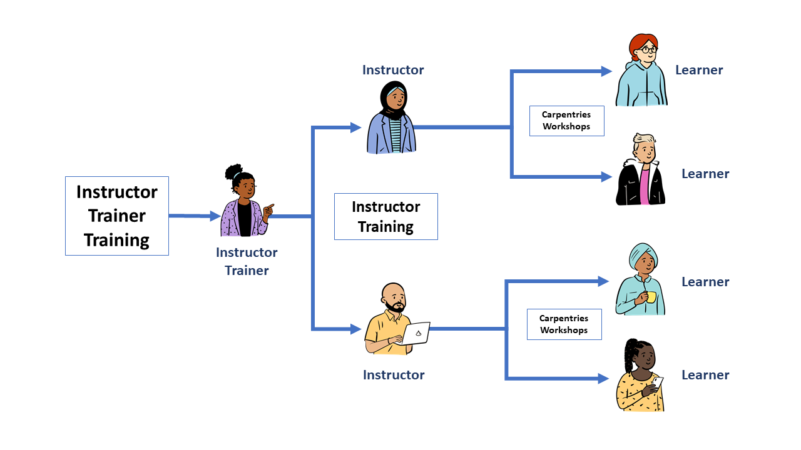

## Building Teaching Skill
At this point in the workshop, we have discussed many cognitive principles and teaching practices that guide collaborative 
development and maintenance of The Carpentries curricula. We hope you are also feeling excited and optimistic about putting 
those concepts to work in your teaching practice! 
One thing we have emphasized is that **teaching is a skill** - and a complex one at that. 
Whether you are new to teaching or skilled in certain methods, adding new features takes takes effort and practice! In this episode, 
we will walk through some techniques for preparing to teach a workshop that we hope will help you to develop goals
and implementation plans that are specific to a workshop. 

As with other sections of this training, we will not be discussing technical preparation. Carefully reviewing the content of your workshop is important, and it
can be useful to anticipate learner questions and update your knowledge accordingly. However, it is common for new Instructors to
over-prepare on technical content -- which can be endless! -- and under-prepare the learner-centered elements of their teaching practice. If you encounter
technical questions that you do not have answers to, showing learners how you Google things may earn you some surprisingly positive feedback. On the other hand, neglecting
to attend to your audience can have a significant negative impact on your workshop.

When you prepare to teach a workshop, 
we suggest setting aside time *before* deeply reviewing your technical content to think through the learner experience, how
your teaching will translate into their learning, and how both of you will know when that happens. In this episode, we will provide
some structure for that preparation.

### Anticipating Your Audience

To teach effectively, you have to know *who* you are teaching. You may have a broad idea about the type of audience you expect. You may
(we hope!) have a plan to learn a few things about your participants after a class has begun. However, in thinking about your learners, it is 
also important to consider the broader contexts they bring in ways that you will never get to fully explore in your classroom. It can be helpful
to reserve time to think through ways in which learners' experiences and needs may be similar to or different from your own, or from each others. 

Whether through learner profiles or more general brainstorming, it is
useful to recognize that you will never know everything about the whole people who come into your classroom. You will not
be informed about their hopes and fears beyond what they choose to present. You will never know the full spectrum of neurodiversity represented in your
workshop. You will not know who is going through a rough break-up, who struggles with an abusive work environment, who has a sick baby at home, or who skipped 
breakfast to save money that morning. Thinking deeply about learners as people can help you prepare to bring your 
best self and provide an inclusive environment for everyone.

## Reversing your Preparation Process

Now that you have a sense of who might be in your classroom, you are ready to think through **their experience with the content you plan to teach**. 
This is different from thinking through the content itself. 

In curriculum design, most people naturally approach development in the order in which they use it. Lessons first, then assessments. Learning objectives
are often created last, if they are created at all. However, learning objectives play the important role of focusing attention on the **learner experience**.

In course design, therefore, we strive to take a ["reverse" approach][Wiggins]. The order of course design in this case becomes

1.  Determine learning objectives, deciding what constitutes evidence that each has been met
2.  Design assessments to generate that evidence, and sort in order of increasing complexity
3.  Design lesson content to connect assessments

This process is much more likely to lead to an appropriately stepped curriculum that guides learners to specific goals and demonstrates to both instructors
and learners that those goals have been met. 

In the case of Carpentries workshops, the lesson has already been designed, and pre-written exercises are often available to use for assessment. Yet, the 
the design process has many similarities to preparation, including a common tendency to start with technical content review, 
work through the exercises, and maybe 
(or maybe not) think through the learning objectives. Here, **reverse 
instructional design** principles might be applied as follows: 

1. Review the lesson's learning objectives carefully, thinking about how they will work for your audience
2. Scan the lesson to identify promising points to check in with your learners, using formative assessment to verify that objectives have been met, and then 
3. Review the connecting content in detail to be sure everything works and you have anticipated likely problems and questions.

## Working With Learning Objectives
All Carpentries lessons should have learning objectives listed at the top of each episode. Did you notice these
in your lesson? In the best 
cases they are quite specific about what a learner should be able to do by the end of each episode.
This can be helpful in both designing additional formative assessments and in evaluating potential additions or digressions for 
appropriateness.

When thinking about learning objectives, it is important to keep the 'level' of a learner in mind. There are many ways of conceptualizing 'level' in education. 
However, you probably have your own sense of what kinds of goals can be achieved by a novice, and what kinds of things can
only be achieved after some 'groundwork' has been laid. 

> ## Evaluate Learning Objectives
>
> Select one learning objective from the episode you've used for teaching practice. Copy it into the etherpad
> then add numbers below your objective to address the following:
>
> 1. Write your learning objective in the Etherpad. 
> 2. Suppose a learner had mastered this objective, and wanted to do more or challenge themselves on the same topic. Identify an objective they could work towards next.
> 3. Suppose a learner struggles to meet the specified objective. Identify one more fundamental thing a learner needs to be able to do in order to be successful in meeting this objective.
>
> This exercise should take about 10 minutes.  
{: .challenge}

## Using Formative Assessments

In your answers above, you may have found yourself using words like "know" and "understand." These are words we are accustomed to using when we talk about 
teaching and learning! However, these terms are so broad that they are actually quite difficult to use when it comes time to *assess* whether a learner has met 
that objective. When do you *know* something? What does it mean to *understand*? 

When we want to check on the completion of a learning objective, we create tasks, and these tasks usually test knowledge and understanding in very specific ways.
For example, we might ask a learner to *recognize* a correct answer, or to *distinguish* between correct and incorrect answers. After working through an example, 
we might ask them to *apply* their knowledge to a new task. When words like these are used in learning objectives, it makes it easier to decide how to assess 
whether an objective has truly been met. 

When a learning objective has been met, everyone should know about it! You, as an Instructor, can be satisfied that your teaching has successfully translated
into learning. For learners, recognizing that they have successfully learned something is motivating and it also supports their ability to monitor their own 
progress -- this awareness, or **metacognition**, is especially key to supporting continued learning beyond the classroom. However, not all lessons have 
checkpoints built in where such progress is made clear.

> ## Where are your checkpoints?
>
> Have a look at your learning objective again and identify
> *where* in the lesson that objective should reasonably be achieved. 
>

When subject area experts design instruction, they are often over-eager to get their learners to work with content they have learned in advanced ways. These 
might include tasks that ask learners to synthesize information from different sources, or create something new based on what they have learned. It is essential 
to recognize that these 'higher order' tasks rely on many layers of fundamental understanding, and are therefore prone to failure when applied to novices. 
Awareness of exactly what underlying knowledge is required at each step will help you to avoid asking too much. For more guidance on identifying the "level" of 
a particular task, we recommend having a look at one of many excellent references on Bloom's Taxonomy.

> How might you apply formative assessment to:  
> a) verify that that achievement has been met by all and  
> b) make learners aware of their accomplishment?  
> Keep in mind that formative assessment can take many forms, including multiple
> choice questions, other exercises, spontaneous questions and calls for sticky
> notes, provided that *all learners are evaluated*. Write some notes or thoughts about this process in the Etherpad for
> discussion.
>
> This exercise and discussion should take about 10 minutes.
{: .challenge}

> ## Instructor Notes
> Many of The Carpentries lessons have
> instructor's notes, with information
> from instructors who have already taught the material.  This can be a valuable
> resource when preparing lessons, especially when teaching a lesson for the first time.  
> The instructor notes are linked on each lesson page under the "Extras" pull down menu.
> In addition, configuration problems and other
> technical hurdles common across multiple lessons are detailed [in this community-developed page][Config] 
> along with suggested solutions. This link is built into each workshop website as well for easy access by learners and 
> during workshops. If you find new problems or solutions, please contribute! We will learn more about workshop 
> websites shortly.  
{: .callout}

## Identifying and Correcting Misconceptions with Formative Assessment

How do we expose misconceptions, especially as they pertain to broken models? How
can we, in-class, know whether the learners already understand this topic
(so that the class can move on),
and if not,
what misconceptions and gaps in their knowledge we should address?

To be effective, instructors need feedback on their learners' progress,
and insight into their learners' mental models.
This feedback comes through what we call *formative assessments* (in contrast
  to *summative assessment*).

> ## Summative Assessment
> *Summative assessment* is used
> to judge whether a learner has reached an acceptable level of competence.
> Learners either "pass" or "fail" a summative assessment.
> One example is a driving exam,
> which tells the rest of society whether someone can safely be allowed on the road. Most assessment done in university
> courses is summative, and is used to assign course grades.
{: .callout}

**Formative assessment** takes place during teaching and learning. It seems like
a fancy term, but it can be used to describe any interaction or activity
that provides feedback to both instructors and learners about learners' level of understanding of the
material. For learners, this feedback can help focus their study efforts. For instructors, it allows them to refocus
their instruction to respond to challenges that learners are facing.  

Learners do not "pass" or "fail" formative assessments; they are simply a feedback mechanism.
For example, a music teacher might ask a learner to play a scale very slowly
in order to see whether they are breathing correctly,
and if not, what they should change.

Formative assessment is most useful when it happens frequently and when the
results are easily interpretable by the learner and instructor.

> ## Repetition vs. Reflective Practice
>
> The idea that ten thousand hours of practice will make someone an expert in some field
> is widely known,
> but reality is much more complex.
> Practice is not doing the same thing over and over again:
> practice is doing similar but subtly different things,
> getting feedback,
> and then changing behavior in response to that feedback to get cumulatively better.
> Doing the same thing over and over again is much more likely to solidify bad habits than perfect performance.
> This is why we emphasize practice and feedback for learners at our workshops and for trainees in our
> Instructor Training program.
{: .callout}

## Formative Assessments Come in Many Forms

There are many types of formative assessment, and each have their advantages and disadvantages.

> ## Formative Assessments
>
> Based on your previous educational experience (or even this training so far!)
> what types of formative assessments do you know about?
>
> Write your answers in the Etherpad; or go around and have each person in the group name one.
> 
> This exercise should take about 5 minutes.
{: .challenge}

One example of formative assessment that we would like to highlight is
the multiple choice question (MCQ).
When designed well,
these can do much more than just measure how much someone knows.
For example,
suppose we are teaching children multi-digit addition.
A well-designed MCQ would be:

~~~
Q: what is 27 + 15 ?
a) 42
b) 32
c) 312
d) 33
~~~
{: .source}

The correct answer is 42,
but each of the other answers provides valuable insight.

> ## Identify the Misconceptions
>
> Choose one wrong answer and write in the Etherpad what misconception is associated with that wrong answer.
> This discussion should take about 5 minutes.
>
>> ## Solution
>>
>> *   If the child answers 32, they are throwing away the carry completely.
>> *   If they answer 312, they know that they cannot just discard the carried '1',
>>     but do not understand that it is actually a ten
>>     and needs to be added into the next column.
>>     In other words,
>>     they are treating each column of numbers as unconnected to its neighbors.
>> *   If they answer 33 then they know they have to carry the 1,
>>     but are carrying it back into the same column it came from.
> {: .solution}
{: .challenge}

Each of these incorrect answers has *diagnostic power*.
Each answer looks like it could be right:
silly answers like "a fish!" may offer comic relief, but do not provide any insight; nor do answers that
are wrong in random ways. 
"Diagnostic power" means that each of the wrong choices helps the instructor figure out
precisely what misconceptions learners have adopted when they select that choice.  

Formative assessments are most powerful when an **instructor responds to the
results of the assessment**. An instructor may learn they need to change their pace or review a particular concept.
Using formative assessment effectively to discover and address misconceptions 
is a teaching skill that you can develop with reflective practice.

> ## Handling Outcomes
>
> Formative assessments allow us as instructors to adapt our instruction to our audience.
> What should we do as instructors if the class chooses:
>
> 1. mostly one of the wrong answers?  
> 2. mostly the right answer?  
> 3. an even spread among options?
>
> For one of the above, enter your answer in the Etherpad.   
>
> This discussion should take about 5 minutes.
>
>> ## Solution
>> 1. If the majority of the class votes for a single wrong answer, you can stop 
>> to work on correcting that one particular misconception.  
>> 2. If most of the class votes
>> for the right answer, it is probably safe to explain the answer and move on. Helpers can make 
>> themselves available to help anyone at risk of being left behind. 
>> 3. If answers are pretty evenly
>> split between options, learners may be guessing randomly, reflecting an 
>> absent mental model rather than a broken one. In this case it is a good
>> idea to go back to a point where everyone was on the same page.
> {: .solution}
{: .challenge}

> ## Modeling Novice Mental Models
>
> Create a multiple choice question related to a lesson you intend to teach.
> 1. Think about the topic of the lesson. What relevant misconceptions might a novice learner bring to the classroom? 
> 2. Create your question. How many choices can you think of that will diagnose a specific misconception?
> 3. Type your question into the Etherpad
> and **explain the diagnostic power of each choice.**
> 
> This exercise should take about 10 minutes.
{: .challenge}

> ## A Note on MCQ Design
>
> *   A good MCQ tests for conceptual misunderstanding rather than simple factual knowledge.
>     If you are having a hard time coming up with diagnostic distractors,
>     then either you need to think more about your learners' mental models,
>     or your question simply is not a good starting point for an MCQ.
> *   When you are trying to come up with distractors,
>     think about questions that learners asked or problems they had
>     the last time you taught this subject.
>     If you have not taught it before,
>     think about your own misconceptions
>     or ask colleagues about their experiences.
{: .callout}

Designing an MCQ with plausible distractors is useful
even if it is never used in class
because it forces the instructor to think about the learners' mental models
and how they might be broken---in short,
to put themselves into the learners' heads
and see the topic from their point of view.

There are many types of formative assessments other than MCQs. One (non-exhaustive) list
to supplement the earlier exercise
can be found in the [Edutopia assessment group][Edutopia].

## Formative Assessments Should Be Frequent

Instructors should use a formative assessment ideally every 5 minutes and
at least every 10-15 minutes
in order to make sure that the class is actually learning.
Since the average attention span is usually only this long,
formative assessments also help break up instructional time
and re-focus attention.
Formative assessments can also be used preemptively:
if you start a class with a question and everyone can answer it correctly,
then you can safely skip the part of the lecture
in which you were going to explain something that your learners already know.

> ## How Many?
>
> The Carpentries use formative assessments often. How many have we done during this episode? Put your guess in the Etherpad along with one example and the purpose that assessment served.  
>
> This discussion should take about 5 minutes.
>
>> ## Solution
>> This will depend on the event they are attending. Most attendees will guess low.
>> The purpose of this exercise is to emphasize the importance of frequent formative
>> assessments and that an individual assessment does not have to take a lot of time.
> {: .solution}
{: .challenge}

> ## "Do You Understand?" is Ineffective as a Formative Assessment
>
> Learners are often reluctant to admit when they do not understand. Furthermore, self-assessments of skill in the absence of formative assessment are often inaccurate
> because of the [Dunning-Kruger effect][Dunning]:
> the less people know about a subject,
> the less accurate their estimate of their knowledge is. Therefore, if you ask a room full of people
> "Do you understand?" the result will invariably be a number of 'yes' responses (many of them inaccurate) which tend to drown out a
> variable amount of silence. Instead, a targeted formative assessment takes the inaccuracy and stress of self-judgement away and 
> demonstrates to all whether the learners' level of understanding has
> met the instructor's goal.
{: .callout}

[Wiggins]: https://www.worldcat.org/title/understanding-by-design/oclc/56491025
[Config]: https://github.com/carpentries/workshop-template/wiki/Configuration-Problems-and-Solutions

