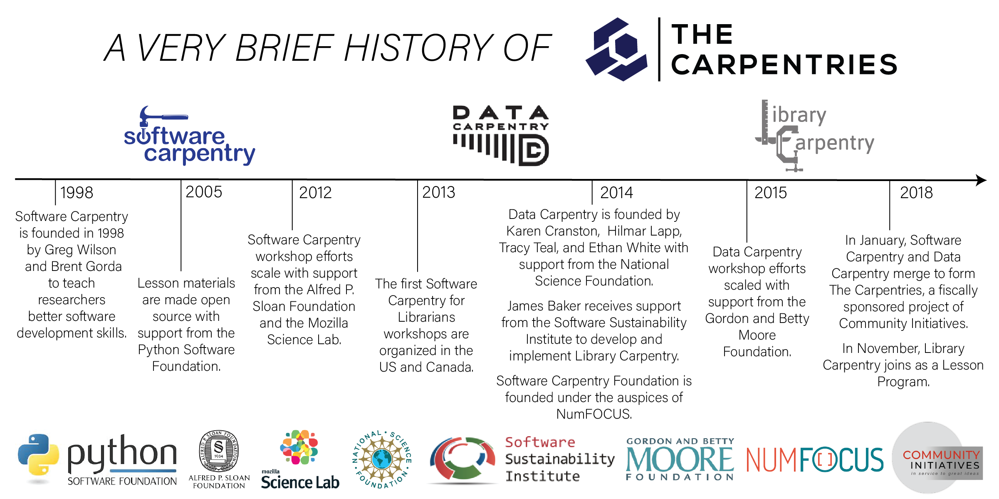

In becoming a certified [Carpentries instructor](https://carpentries.org/instructors/),
you are also becoming part of a community of like-minded volunteers.
This section provides some background on
[The Carpentries]({{ site.carpentries_site }}) organization, how to participate
in one of our primary activities (running workshops), and other ways to get
involved with the community.

## A Brief History

[Software Carpentry]({{ site.swc_site }}) was founded in 1998 with the mission of teaching lab skills for research computing.
[Data Carpentry]({{ site.dc_site }}) was founded in 2014 with the mission of building communities teaching universal data literacy.

Also in 2014, [Library Carpentry]({{ site.lc_site }}) was founded with the mission of teaching data skills to people working in library- and information-related roles.

On January 1, 2018, Software Carpentry and Data Carpentry merged
their projects to form a new project called
[The Carpentries]({{ site.carpentries_site }})
under the fiscal sponsorship of
[Community Initiatives](https://communityin.org/).
Within this new organization structure, Software Carpentry and Data Carpentry retain their individual identities as Lesson Programs of the Carpentries.
On November 1, 2018, The Carpentries Executive Council
approved [Library Carpentry]({{ site.lc_site }})
as the third official Lesson Program of the Carpentries.

The Carpentries project comprises communities of Instructors, Trainers,
Maintainers, helpers, and supporters from
[Software Carpentry]({{ site.swc_site }}), [Data Carpentry]({{ site.dc_site }}) and [Library Carpentry]({{ site.lc_site }})
who share a mission to teach foundational computational and data science skills.

You can learn more about the history and goals of each Lesson Program by reading
"[Software Carpentry: Lessons Learned](https://f1000research.com/articles/3-62/v2)",
"[Data Carpentry: Workshops to Increase Data Literacy for Researchers](http://ijdc.net/index.php/ijdc/article/view/10.1.135)" and
"[Library Carpentry: software skills training for library professionals](https://www.liberquarterly.eu/article/10.18352/lq.10176/)"".

## Similarities and Differences between The Carpentries Lesson Programs

All lesson programs under The Carpentries share the same value
of promoting efficient, shareable, and reproducible research practices.
Their aligned missions are accomplished by running accessible, inclusive training workshops; teaching openly available, high-quality, community-developed lessons; and fostering an active, inclusive, diverse instructor community that promotes and models reproducible research as a community norm.

Similarities between Software, Data and Library Carpentry workshops include:
*   a focus on technical skills.
*   an two-day format taught by volunteer instructors.
*   a focus on filling gaps in current training for learners.

The major differences between Software, Data and Library Carpentry workshops
are their content and intended audience.

Software Carpentry workshops are:

*   intended for people who need to program more effectively to solve their
computational challenges,
*   not domain-specific, and
*   modular---each Software Carpentry lesson is standalone.

Data Carpentry workshops:

*   are aimed at pure novices,
*   are domain-specific,
*   focus on best practices surrounding data, and
*   present a full curriculum centered around a single data set.

Library Carpentry workshops:

*   are aimed at people in library- and information-related roles,
*   focus on best practices in data structure, and
*   are modular---each Library Carpentry lesson is standalone.
*   are sometimes less than two days.

In a visual representation, these similarities and differences look like this:

## What is a Carpentries Workshop? The Rules.

### Using the Names and Logos

The names "Software Carpentry", "Data Carpentry" and "Library Carpentry"
and their respective logos
are all trademarked.
You may only call a workshop a Software Carpentry, Data Carpentry, or Library Carpentry workshop if:

*   it covers the core topics (see below),
*   at least one of the instructors is a certified Carpentries Instructor,
*   you run our standardized pre- and post-workshop assessments and ensure everyone participates, and
*   you send us summary information about attendees (at a minimum, the number of people who attended).

### Materials

Note that the individual Software Carpentry, Data Carpentry, and Library Carpentry lessons
materials are freely available under a permissive [open license]({{ page.root }}).
This means that you may use them in contexts outside a Carpentries workshop (e.g. as material
introduced into a longer course, as a standalone 2-3 hour session, as homework exercises, etc.)
provided you cite the original source.

It is only when you want to run a branded "Carpentries" workshop using the materials
that the requirements listed above are needed.

### What is the Core Curriculum?

A Software Carpentry workshop must include [lessons](https://software-carpentry.org/lessons/index.html)
on version control (e.g. Git), the UNIX shell,
and a programming language (e.g. R or Python).

A Data Carpentry workshop must include a Data Carpentry [lesson](https://datacarpentry.org/lessons/)
on data organization and three
other modules in the same domain from the Data Carpentry curriculum.
Published curricula include the Ecology, Genomics, Social Science and Geospatial workshop materials.
Additionally, Astronomy, Digital humanities, Economics and Image analysis curriculum are under development.

A Library Carpentry workshop must include three to four of the
[core lessons](https://librarycarpentry.org/lessons/#core-curriculum), which include an introduction to data, the UNIX shell, OpenRefine, and Git.
Library Carpentry also maintains an "extended" set of lessons
that can be taught in addition to the core curriculum
These lessons are taught infrequently or are under development and include:
SQL, webscraping, Python and an introduction to data for archivists.

Within these guidelines, there is flexibility in which episodes of the lesson you cover,
which exercises you use, and whether you include optional materials (e.g. callouts) and
optional episodes.

### Who Can Teach What

People who have gone through the two-day instructor training course and completed
the [the checkout process]({{ page.root }}/checkout/) are considered "certified"
Carpentries instructors and can teach curricula for **any** of the lesson programs
(Software Carpentry, Data Carpentry, or Library Carpentry)
as they feel able. While instructor badges
may list a primary lesson program affiliation, instructors are **not** required to certify separately for each. For more
information, see the description of [the instructor checkout procedure]({{ page.root }}/checkout/).

Note that as long as you have at least one certified instructor, the other
instructors and helpers at a branded workshop do not have to be certified. We
rely on the judgment of local organizers to recruit and orient volunteers who
will embody the Carpentries ethos and practices.

> ## Local Support
>
> There is a great list
>
> here in the handbook [Helper Checklist and Suggestions](https://docs.carpentries.org/topic_folders/hosts_instructors/hosts_instructors_checklist.html#helper-checklist).
{: .callout}

## How to Run a Carpentries Workshop

The [**Carpentries Handbook**](https://docs.carpentries.org/) is a community-developed resource that
provides tips, checklists, and points of contact for nearly all Carpentries-related activities in one location.
The Carpentries Handbook is the definitive source for policies and information.
Here, we will cover some information about actually running a workshop.

Briefly, there are two types of Carpentry workshops: centrally-organized and
self-organized. Centrally-organized workshops are organized by a team of
[Regional Coordinators](https://carpentries.org/regionalcoordinators/) who take care of logistics and administration such as
finding instructors and handling workshop registration. For self-organized
workshops, the organization hosting the event is responsible for these details.

> ## Workshops as an Instructor
>
> As an instructor, you may be primarily teaching at local workshops or you
> may not have local opportunities, or you may just want to
> teach somewhere else.
>
> If you want to teach non-locally, you should be sure to join our instructor
> mailing list during the community exercise below, so that you hear about
> upcoming teaching opportunities.
>
> Note that the Carpentries does not guarantee
> that instructors will get to teach at workshops after they are trained, so the
> best way to make sure that you get to teach (if you want) is to try running
> a workshop or even a single lesson yourself. It can seem daunting to organize
> your own workshop, but as long as you have 1-2 people who can either help or
> co-instruct, the Carpentries staff and community can provide
> support and guidance so that it's not so scary!
{: .callout}

In both cases (self- or centrally-organized), you can start the workshop
process by completing the [Carpentries workshop request form](https://amy.carpentries.org/forms/workshop/).

For more details on how to run each type of workshop, see:
* [The Carpentries Handbook: Teaching and Hosting](https://docs.carpentries.org/topic_folders/hosts_instructors/index.html)

or the the following Lesson Program specific references:
* [Data Carpentry](http://www.datacarpentry.org/workshops-host/)
* [Library Carpentry](https://librarycarpentry.org/workshops/)
* [Software Carpentry](https://software-carpentry.org/workshops/request/) workshop pages.

Policies related to instructor training and workshops The Carpentries can be found in [the policies repository](https://github.com/carpentries/policies). Please
be sure to read through the [instructor no-show policy](https://github.com/carpentries/policies/blob/master/instructor-no-show-policy.md) before signing up for your first workshop.

### Setting Up

In order to communicate with learners,
and to help us keep track of who's taught what and where,
each workshop's instructors create a one-page website with information about their workshop.
Once that has been created,
the host or lead instructor sends its URL to
the [workshop coordinator](mailto:team@carpentries.org),
who adds it to our records.
The workshop will show up on our websites shortly thereafter.

You may also create an etherpad for your own Carpentries-related events. When you point a browser to a url at
`pad.carpentries.org/name-of-pad` you will either arrive at an existing etherpad by that name or a brand new
etherpad with basic Carpentries information at the top.  For workshops we use `year-month-day-venue` as the name
to ensure unique names.

> ## Practice With The Carpentries Infrastructure
>
> Go to the [workshop template repository]({{ site.workshop_repo }})
> and follow the directions to create a workshop website using your local location and today's date.
> Put the link for your workshop website into the Etherpad.
>
> This exercise should take about 25 minutes.
>
> Note: Sometimes web browsers will cache the workshop webpage, so when
> you make changes in GitHub, they don't show up on the workshop webpage
> immediately.  Two ways to avoid this are to use a "private" or
> "incognito" mode in your web browser or by following these
> [instructions to bypass your browser cache](https://en.wikipedia.org/wiki/Wikipedia:Bypass_your_cache).
{: .challenge}

> ## Question and Answer
>
> What questions do you have about running and teaching at a workshop? Talk with a partner and
> enter your questions into the Etherpad. At this time we will also return to discuss questions remaining from the beginning of the day.
>
> Leave about 10 minutes for this discussion.
{: .challenge}

## A Culture of Contribution

In the same way that we hope to promote a
culture of openness, sharing,
and reproducibility in science and research through training researchers with
the tools they need, the
Carpentry organizations themselves aim to be open, collaborative, and
based on best practices.  We want to draw together the collective expertise of
our teaching community to create collaborative lessons, share other materials,
and improve the lessons via "bug fixes" as we go along.

> ## Lesson Incubation
>
> Maybe this instructor training has inspired you to go home and write your
> own fantastic lesson!  If you'd like to model it after the Software, Data and
> Library Carpentry lesson format, you can find a template and instructions in [the Carpentries lesson example repository]({{ site.example_repo }}).
{: .callout}

> ## Many Ways to Contribute
>
> We recognize that the medium of GitHub may be restrictive to those
> who wish to contribute to our lessons.  We are always searching for
> ways to make the process more friendly to all, whether that be
> contribution training, or alternative routes to contribution.  If you
> have any ideas how we might make contribution more contributor-friendly,
> please let us know.
{: .callout}

Being part of a friendly, open discussion, is of equal or greater importance
to the community than submitting the perfect lesson change.  The
[checkout process]({{ page.root }}/checkout/) to become a certified instructor will be
one way to start connecting to the community and find which area will allow you
to contribute best.

## The Carpentries Community

As you can imagine, based on the above, there are many aspects of running the Carpentries!
While there are a small number of dedicated staff who work for the Carpentries organization,
the real power of the Carpentries is in its community of volunteers that take on all sorts of
roles to teach and organize workshops, help produce and maintain lessons, and most importantly,
build local and global communities of practice around  skills for data analysis, computational thinking, and research software development. Our community depends on individuals like you who are passionate about expanding these communities of practice through inclusive and evidence-based instructional practices, and can contribute your perspective and expertise to continually refine our instructional materials and practices.  A full description of the breadth and diversity of community member roles, an overview of the Carpentries' various social media channels, a calendar of future community events, and descriptions of mailing lists used by the community can be found [here on the Carpentries website](http://static.carpentries.org/community/) and also on the [getting connected page](https://carpentries.org/connect/).

> ## Participating in the Carpentries -- What's Your Role?
>
> If you are at an in-person training, your instructor will hand out paper copies of a worksheet. If you are at an online training, you can get a [digital copy here]({{ page.root }}/files/handouts/Carpentries_roles_worksheet_v4.pdf).
>
> Take a moment to review member community roles on the [Carpentries' community website](http://static.carpentries.org/community/). Working on your own, match up the roles with the descriptions. When you are done, think about the question at the bottom of the worksheet about what roles you might play, and enter your thoughts in the Etherpad.
>
>> ## Solution
>> Instructors: C
>> Mentors: E
>> Trainers: D
>> Lesson developers: J
>> Curriculum advisors: B
>> Lesson maintainers: F
>> Lesson Infrastructure Team: I
>> Assessment Team: K
>> Champions: L
>> Infrastructure Team: H
>> Regional Coordinator: A
>> Code of Conduct Committee: G
> {: .solution}
> This exercise should take about 10 minutes.
{: .challenge}

> ## Get Connected
>
> Take a couple of minutes to sign up for the Carpentry discussion channels you want to stay involved with.
{: .challenge}
