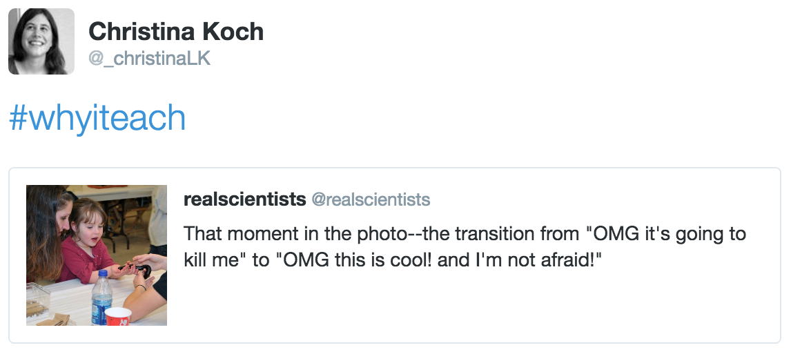

> ## Steve Crouch
>
> Writing software in an academic environment can be a real challenge,
> and a very rewarding part of my job involves helping researchers improve their research software,
> and perhaps more importantly,
> the way in which they develop it.
> Transferring crucial skills into the wider community as a teacher allows me to reach even more people,
> and help improve the overall situation with developing research software at an early stage of many researcher's careers.
>
> I have found Software Carpentry to be a truly transformative and fascinating experience,
> not only for those I teach but also for myself,
> and reinforces the notion that improving and learning new research software development skills
> is a continuous and vastly rewarding experience.
{: .testimonial}

> ## Neal Davis
>
> In my day job, I teach students how to use engineering and computer science tools.
> By temperament and experience,
> I strongly favor an apprenticeship approach for instruction,
> and the Software Carpentry model of direct learner–instructor interaction in a hands-on setting
> is a decent short-term approximation.
> This allows students to rise to their current level of technical sophistication during the workshop,
> and to discover the answers to questions they don't know how to pose verbally.
>
> What particularly fascinates me is the way learning works and the way scientific and technical knowledge is structured.
> It's exciting to create and foster technical communities to take advantage of new channels for learning and teaching,
> as well as for research and engineering.
> SWC and DC are on the vanguard, and I'm proud to be a part.
{: .testimonial}

> ## Rayna Harris
>
> During the past decade or so,
> I've realized that grad students teach themselves much of what they learn during grad school.
> Of course self-teaching is a valuable process in the road to becoming an independent researcher,
> but I thank that we could be more productive, successful, efficient, and impactful teachers and researchers
> if we learned some things with hands-on instruction and guidance rather than with Google and trial and error.
>
> I joined the Software Carpentry and Data Carpentry organizations
> because I was looking for a community of role-models I could look up to
> that taught beginner computing effectively and taught teachers how to teach beginner computing effectively.
> Without a doubt,
> my involvement with the Software Carpentry community has helped me to become a better teacher, scientist, and collaborator.
> I'm very excited to be an instructor trainer so that I can empower others
> with tools, confidence, and resources they need to advance their careers.
{: .testimonial}

> ## Christina Koch
>
> 
>  
> I love sharing ideas with people. The best moments in life, for me, are facilitating 
> intellectual insights along with personal connections. Those moments are what build 
> a community that continues living in hope and adventure, especially important in 
> times of fear and division. I teach to make those moments possible for myself 
> and for others.
{: .testimonial}

> ## Lex Nederbragt
>
> Teaching in general,
> and at Software and Data Carpentry workshops in particular,
> gives me great pleasure and is one of the most personally rewarding activities I engage in.
> With Software Carpentry,
> I feel I belong to a community that shares many of the same values I have:
> openness, tolerance, a focus on quality in teaching to name a few.
> The instructor training program is the best pedagogical program I know of,
> and it is amazing to see how Software and Data Carpentry are building a community of educators
> that are fully grounded in the research on educational practices.
>
> Being an instructor is my way of making a small,
> but hopefully significant,
> contribution to improving science, and thus the world.
{: .testimonial}

> ## Aleksandra Pawlik
>
> I teach for purely selfish reasons.
> It is a great feeling when attendees come up to me during or after the workshop
> saying how useful they found it.
> It feels great when attendees engage in the lesson or discuss exercises in pairs
> and I see them being truly happy when they get the computer to do what they want.
> It feels great when I accidentally meet one of the participants some time after the workshop
> and they say how much the teaching helped them in their research.
> It's all very rewarding and gives me a sense of accomplishment. I'm a hedonist, after all.
>
> I also had a very bad experience as a student studying Computer Science.
> With a lot of struggle I graduated convinced that
> I'm too stupid to do anything related with computers for a living or even as a hobby.
> I don't want other people to feel like that.
{: .testimonial}

> ## Fiona Tweedie
>
> My training is in Ancient History and Classics,
> and I believe that a community that draws on a diversity of backgrounds and disciplines is ultimately stronger.
> The Humanities must have a place shaping our discourse and our future
> and I see myself as a translator and guide in this emerging world.
>
> As someone not from a programming background I've asked all the basic questions
> and I'm always on the look-out for approaches that don't cross over from the sciences satisfactorily.
> Both the frustrations and satisfactions of getting to grips with code for the first time are very fresh in my memory.
> I hope that seeing a Latin major up the front of the room reassures students that
> they can become capable software carpenters in their own rights.
{: .testimonial}

> ## Anelda van der Walt
>
> The most attractive advantage of being part of the Software Carpentry community is exactly that: the community.
> I have been actively involved in Software Carpentry since the end of 2014 as a learner, helper, organizer, and instructor at several workshops.
> Over the last 18 months I never felt isolated from the international Software Carpentry movement
> despite being on a different continent from most of the activity.
> Our South African initiatives have been supported every step of the way
> by the organization's leadership and the wonderful people who volunteer as instructors.
>
> I believe the Software Carpentry model is extremely well-suited to building capacity in low and middle income countries.
> I have heard wonderful testimonials from many people who've been learners in Software Carpentry workshops in South Africa
> in terms of how their participation has impacted their research.
> I'm excited to be making a difference.
{: .testimonial}

> ## Alistair Walsh
>
> I love teaching.
> Seeing the wide eyed moment of realization that I see on learners faces when something "clicks" is one of the best feelings in the world.
> Why I want to teach the Software Carpentry method in particular is because
> I think everyone needs to know how to code and SWC is the most effective way I've seen to achieve that.
>
> Coding is the new literacy
> and I want it to be a skill that everyone has so that we all takes part in shaping our world
> rather than it being a few people from a narrow range of backgrounds and experiences.
> I hope that as an instructor trainer I can inspire more SWC instructors to bring this new world about.
{: .testimonial}

> ## Belinda Weaver
>
> I've worked in a university for more than twenty years in a variety of roles - librarian,
> library manager, Internet trainer, journalism teacher - and I've seen how researchers'
> training needs have changed dramatically over that period. Increasingly, researchers
> need to find answers in data they already have, are collecting, or are generating - and they can't
> do that without tools. The data are too big now, and the scale of research is so much larger.
>
> Research training barely addresses the fact that all researchers now need to think
> computationally, and that they desperately need tools to increase their speed and efficiency
> in analyzing data. This is a gap that Software and Data Carpentry training can fill.
>
> It's not a good day for me if I haven't helped *someone*. Being able to introduce people to
> useful, time-saving tools has been a big - and immensely satisfying - part of my working life.
> That is why I trained as an instructor.
{: .testimonial}

> ## Jason Williams
>
> I am fascinated and privileged to have the opportunity to work at the intersection of the biological and the technological.
> Working in the world of bioinformatics and education,
> I actually spend a fair amount of time travelling to institutions across the U.S. and abroad.
> I'm amazed at the people I get to work with
> and believe Software Carpentry's mission creates an opportunity to add the distinctiveness of our learners
> and their perspectives to our own unique approach to education.
> Collaboration is key to having thousands of scientists working as one,
> and to me this idea is irresistible.
> As the saying goes,
> "We are braver together than we are alone."
{: .testimonial}

> ## Greg Wilson
>
> My daughter is eight years old,
> and is going to inherit all the problems my generation did not have the backbone to solve.
> Climate change,
> mass extinctions,
> drug-resistant diseases,
> resource shortages:
> if we had started working on them twenty years ago we'd be done now,
> but instead we ducked and dithered,
> so that all those bills are going to come due in her lifetime.
>
> I believe the only things that will get us through the next fifty years are more science and more courage.
> I co-founded Software Carpentry to help with the science part of that equation,
> but over the last few years I've come to believe that we can help with the courage as well.
> We are braver together than we are alone;
> by teaching scientists how to collaborate on research today,
> we are preparing them to work together on things that really matter tomorrow.
{: .testimonial}
