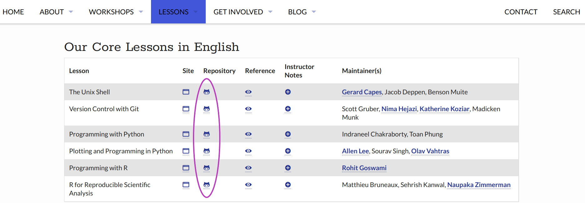

## Instructor Checkout

After attending Instructor Training, there are three steps to complete before qualifying as a Certified Carpentries Instructor.
Briefly, the three steps are:

1. [Attend a Welcome Session](#welcome). A 1-hour onboarding to the Instructor and global Carpentries community.
2. [Complete a Teaching Demonstration](#demonstration). A 1-hour session where trainees demonstrate 5 minutes of participatory instruction and share feedback, with evaluation by a Carpentries Instructor Trainer.
3. [Get Involved!](#getinvolved) Choose one more step to further your engagement with The Carpentries.

#### How will the Checkout steps be tracked?
 **For the “Get Involved” step, trainees must login to AMY to report which participation option they would like to have counted.**
 Welcome Sessions and Teaching Demonstrations will be tracked automatically based on data shared by session hosts.

#### Checkout Deadline
All trainees have 3 months (90 days) from the end date of their training to complete checkout. If you need more time,
3-month extensions may be requested by emailing [instructor.training@carpentries.org](mailto:instructor.training@carpentries.org).
Extensions may be granted for any reason up to 1 year from your training date.

:::::::::::::::::::::::::::::::::::::::::  callout
## Help! I have a Question about Checkout!

If you have a question, you can email us at instructor.training@carpentries.org or visit the [#checkout-support](https://slack-invite.carpentries.org/) slack channel.

::::::::::::::::::::::::::::::::::::::::::::::::::

## 1\. Welcome Session {#welcome}

The purpose of having you attend a Welcome Session is to introduce you to other members of our global community, share the many
opportunities for engagement with The Carpentries, and address any new or lingering questions about how
it works to volunteer as an Instructor.

Welcome sessions are a specific type of Community Session. While you can attend other types, we ask that you attend a welcome session specifically
for this step. If you see another session you would like to attend, you may choose to apply that to fulfil your [Get Involved step](#getinvolved).

Sign up on the [Community Welcome Sessions Etherpad][welcome]. Other types of sessions can be accessed from the [Community Sessions Etherpad][discussion].
**Take care to double check
the time zone**, and mark your calendar after signing up! At the time of the event, the Zoom link may be found at the top
of that Etherpad.

:::::::::::::::::::::::::::::::::::::::::  callout

## Carpentries Tools: Etherpads

The Etherpad is a collaborative note-taking tool that is widely used in Carpentries workshops and many other activities in the community.
We also use Etherpads for sign-ups and notes on recurring events, like community events and teaching demonstrations.
Most Etherpads for recurring events are linked from our ["pad of pads"][pad-of-pads].
This is a great one to bookmark and use as a reference throughout your checkout process and as a newly minted member
of The Carpentries community.

::::::::::::::::::::::::::::::::::::::::::::::::::

### Preparing for your Welcome Session

Welcome sessions are intended for new community members in all roles, with Instructor-specific sections to assist with onboarding as a volunteer
in this role. You do not need to do any homework in advance!
However, it can help to put a little thought into what questions you have. If you ask a question, there will likely be
other people there who also want to hear the answer! Some themes to guide your thinking include:

- what happens after you express interest in teaching a centrally organised workshop
- how to recruit help for your self-organised workshop
- how teaching and other responsibilities are distributed among team-members
- adaptations or modifications to curricular materials
- broader questions about the value or experience of teaching Carpentries workshops

### In-Person and Virtual Alternatives

Occasionally, a Welcome Session may be approved to occur in-person. This is most common in areas with limited internet
access or in association with larger events like conferences or extended workshops.

### Getting Credit

After each Welcome Session, hosts submit a form that includes the names of attendees who identified themselves as
fulfilling their Instructor checkout requirement. This is indicated by writing "checkout" next to your name when you register in the Etherpad.
As long as you
indicate that you are completing checkout and attend the event you are signed up for, it is not necessary to email us after attending a Welcome Session.

## 2\. Teaching Demonstration {#demonstration}

The teaching demonstration serves several purposes. First and foremost, it is an opportunity to **both give and receive feedback** on
a more polished presentation after you have had some time to reflect on your lesson and what you have learned in this training. In
addition, it is an opportunity to **spend some time reviewing a lesson** more carefully in advance of your first workshop.
Finally, it is an opportunity to receive **feedback from a Carpentries
Instructor Trainer** (like your Trainers at today's event), who will help make sure you are prepared for a strong start.

### Selecting an Eligible Episode

For your teaching demonstration, you will prepare to teach **a 5 minute segment of an approved Carpentries Lesson,
starting at the beginning of an episode that includes participatory live instruction**.

To select an episode, please visit this [list of recommended episodes][start-points]. **If your preferred lesson is not on the list or includes
only ineligible episodes, please choose a different lesson.** Lessons in The Carpentries Incubator are not eligible for use in teaching demonstrations. If you believe you have a lesson or episode that should be eligible but is not on the list, please contact us.

If you arrive at your demo prepared to teach an episode that is ineligible, your Trainer may offer you a choice between
teaching from an appropriate episode (other than the one you prepared) or rescheduling your demo (to allow time to prepare an appropriate episode).

### Starting in the Middle
Demonstrating an episode that falls later in a lesson can be fun! It also helps to ensure that other trainees who choose the same lesson
won't all be starting from the same place during the demo session. When selecting an episode that follows others, be aware that some
steps may rely on files or folders created or modified in earlier episodes. These episodes are labeled on our [recommended episodes page][start-points].
If you choose an episode with dependencies, be sure to have everything
in the right place and ready for your start point when you arrive for your demo.

:::::::::::::::::::::::::::::::::::::::::  callout

## Carpentries Terminology: Lessons vs Episodes
A "lesson" corresponds to a single line in the lesson table and a single repository in GitHub
(An example of a lesson: [R for Reproducible Scientific Analysis][r-gapminder]). The episodes within a lesson are numbered and listed in a collapsible window on the left side of the main lesson page. After 14 August, 2023, **you do NOT need to prepare a full lesson**, but should select a single episode within that lesson.

::::::::::::::::::::::::::::::::::::::::::::::::::

### Demos are Fun!

It can be nerve-wracking to perform in front of others! This is also true when you teach, but there is a special kind of stress that comes with inviting feedback and approval from strangers.
It may help to know that, when we have surveyed our community about their experiences with the checkout process,
demos were praised throughout as highly useful, enjoyable, and worthwhile. As much as possible, try to relax and
enjoy this friendly opportunity for connection with others in our community. Remember to embrace your mistakes!

In some cases, an Instructor Trainer may ask you to repeat your teaching demonstration another time prior to certification. If this
happens, they will be very clear about exactly what they would like you to change on your second appearance, and why. These requests
are made with your interests at heart -- we want you to be prepared for success when you set out to teach!

Trainers draw from their own experience and training when they evaluate teaching demonstrations, but we do provide a
[rubric][demos-rubric] for their reference. This can be a helpful resource as you prepare.

### Sign-up and Set-up

To sign up, select a session that works for you on [the Instructor Training Demonstration Sessions Etherpad](https://pad.carpentries.org/teaching-demos), and add
your name and a link to your chosen episode to that Etherpad. Be sure to **double check the time in your local time zone** by clicking on the converter link posted.
Also, examine the demo description to ensure that it is not a special session targeting a specific sub-community or
language (unless you are part of that target group).

The link to connect to the video conference is at the top of the Teaching Demos Etherpad.
Your Trainer may send an email with confirmation and/or additional instructions prior to your demo.
If possible, plan to use a headset with built-in microphone for the best audio experience.

### During the Demo

For your demonstration, you will screen-share and live code (or teach other participatory content) for 5 minutes. You may use any notes you want, but
please do not display them on your screen. Teach as you would in an actual workshop.
When your five minutes are up, the Trainer leading the session will call time,
and then you and everyone else taking part in the session will give feedback on your teaching.
You will be asked to give feedback on yourself as well as on others;
your Trainer will likely recommend a feedback structure using two axes of positive vs. constructive
and content vs. presentation, just as you have done during this training.

### Languages Other than English

If you want to do your demonstration in a language other than English,
please contact us at [instructor.training@carpentries.org](mailto:instructor.training@carpentries.org).
We may not be able to accommodate all languages, but we will do what we can!

### Getting Credit

After each teaching demonstration, Trainers submit a form that includes the names and passing status of each attendee. They will
also email you to let you know, as this information is typically not shared during the demo session. It is not necessary to email us
after you have attended your teaching demonstration.

## 3\. Get Involved! {#getinvolved}

The purpose of this step is to encourage you to take a first step towards further engagement with
The Carpentries, choosing a path that works well for you. Any participation in Carpentries activities
or processes may be submitted to satisfy this requirement! We have a few suggestions to get you started:

- Serve as an Instructor or a Helper at a workshop
- Attend a regional call, skill-up session, or other community programming
- Submit a contribution to a Lesson, Glossario, or other Carpentries repository

### Serve as an Instructor or Helper at a Carpentries Workshop
If you attended Instructor Training because you want to get started participating in workshops as soon
as possible, this step is for you! When you submit this step, you will be asked to share the date and
workshop website link.

Did you serve as a Helper or un-certified co-Instructor before you attended Instructor Training?
That counts!

### Attend a Regional Call, Skill-Up Session, or Other Community Programming
The Carpentries offers a wide array of programming to meet the needs and interests of our community-members. Attending or hosting any of these
sessions can be used to fulfill your Get Involved step for Instructor checkout. For more on the different types of Carpentries community
programming, [see this blog post](https://carpentries.org/blog/2023/04/new-community-programming/) or go directly to the
[Community Sessions Etherpad][discussion] to look for sessions that will work for you!

### Contribute to the construction or maintenance of Carpentries materials
The Carpentries' lessons are built, sustained, and improved only through the collaborative effort of our community members.
All Instructors should feel empowered and invited to participate! Taking a first step to walk through the
contribution process is a great way to complete your Instructor certification.
If you would like help making a lesson contribution consider making a post in the #first-time-contributors channel on [The Carpentries Slack][slack]. This channel is overseen by our Curriculum team and can be useful for contribution questions long after you have completed your checkout process.

#### Why Contribute to Carpentries Lessons?
If you are interested in getting involved in The Carpentries, you may also be interested in becoming more involved in the
open source tools we teach and the communities that revolve around them. The Carpentries community is a safe and friendly space to
learn to how to participate in open collaboration on GitHub. You can apply what you have learned here to engage elsewhere, with the tools you
love and the people who develop them!

In addition, because The Carpentries curricula are collaboratively developed and maintained, all direct contributors become authors on
Carpentries lessons! If you submit a pull request to a lesson that is accepted and merged by the maintainers, you will be listed as a co-author
on the lesson's next release.

#### Keep It Simple!
We suggest starting small! Consider commenting
on an existing issue, fixing a typo if you find one, or contributing a single term to our multilingual glossary. If you would like
to help us out with something more substantial, consider selecting an item from our [Help Wanted page][help-wanted].

#### How to Contribute? GitHub 101
The curriculum for this workshop, like all Carpentries curricula, is hosted on GitHub. This gives you access to a 'back room' where the code for the
curriculum website is freely available, suggestions for changes can be proposed, and conversations about potential changes can be held.

To get there, try looking for a link that says "Edit this page". In this curriculum, that is located at the top of the page, underneath the title.

{alt='Screen shot of the header for this page with Edit this page circled' width="800px" }

Alternatively, you can find links to the GitHub repositories for each lesson next to the links to the lessons sites on the websites listing [Data Carpentry](https://datacarpentry.org/lessons/), [Library Carpentry](https://librarycarpentry.org/lessons/), or [Software Carpentry](https://software-carpentry.org/lessons/) lessons:

{alt='Screen shot of Sofware Carpentries Lessons list in a browser with Links to Lessons Repositories circled' width="800px" }

The browser view of the GitHub repository for this workshop looks like this:

{alt='Screen shot of Instructor Training GitHub repository in a browser with Issues and Pull Requests tabs circled' width="800px" }

There are two tabs on this page that offer opportunities for interaction with the community that maintains this curriculum. The first is the "Issues" tab.
When someone has an idea or suggestion, they can start a conversation about their idea by creating an Issue. Others can then comment on the Issue to provide
feedback. Issues can be searched, using the search bar at the top:

{alt='Screen shot of Instructor Training GitHub repository with Issues tab selected and search bar and New Issue button circled' width="800px" }

If you have an idea, it is a good idea to search first to see if anyone else has already suggested it! If so, you can add your thoughts as a comment
on the existing issue instead of starting a new one. Either way, you can submit a link to the conversation with your contribution for your Get Involved step. Note that you must be signed
in to GitHub to be able to see the comment box at the bottom of each issue.

{alt='Screen shot of Instructor Training GitHub repository with a single Issue selected and comment box circled' width="800px" }

If you find something that you know how to fix by changing the code of the lesson, you may instead wish to submit a Pull Request (PR). You can also view
and comment on existing PRs. We will not cover the details here, but there is [a
community-contributed guide on how to create a PR][github-guide] that can help.

Each lesson repository has a document, named `CONTRIBUTING.md`, that outlines contribution guidelines. The [guidelines for this repository
are here][contributing]. Maintainers for each repository may choose to customize their own guidelines.

#### Alternatives to GitHub

All Carpentries curricula (including this one) are hosted on GitHub. Learning to interact on GitHub can have many benefits,
including the ability to contribute to other open-source projects! However, we understand that there are many
reasons why trainees may wish to avoid engaging on GitHub. That's ok!

If you do not use GitHub, you may submit your contribution via [this form](https://docs.google.com/forms/d/e/1FAIpQLSeMBOj5Rdh8Mgk0ebRbeRyHhGHKbItdft6avWuEzmeg8CgWbA/viewform).  A Carpentries Core Team member will create an issue based on the relevant repository, and will send you a link so that you may view any responses.

:::::::::::::::::::::::::::::::::::::::::  callout

## Help Wanted: Breaking Down Barriers

At The Carpentries, we know all too well that tools and technical procedures can present a serious barrier to progress.
That is why we exist! So we appreciate the irony when participation in our community demands tools or technical
procedures that may not be familiar or accessible to all who wish to contribute. GitHub, in particular is often recognized as an obstacle;
this is something our community has [discussed extensively][git-blog].

We are actively invested in making our processes as friendly and inclusive as possible, and that includes supporting our
community in surmounting the barriers presented by our own technologies of choice. Watch our channels for
opportunities to develop your skills as a contributor! In the mean time, if you
have any ideas about how we can make our resources more contributor-friendly,
please [let us know][contact-page].

::::::::::::::::::::::::::::::::::::::::::::::::::

#### Eligible Repositories

The only eligibility rule for contributions is that they must be made to a repository that is managed by The Carpentries. That includes:

- any [Data Carpentry](https://datacarpentry.org/lessons/), [Library Carpentry](https://librarycarpentry.org/lessons/), or [Software Carpentry](https://software-carpentry.org/lessons/) lesson
- the Carpentries Instructor Curriculum (this site)
- any [community developed lesson][carpentries-incubator] in The Carpentries Incubator
- our open source, multilingual glossary of data science terms, [Glosario][glosario-github]

Repositories that are **not** eligible for contribution credit include forks of Carpentries repositories and
other Carpentries-based content that is not located
in a Carpentries repository. This is because The Carpentries Code of Conduct does not apply outside of Carpentries spaces. If you submit a
link to an ineligible repository for this step, we may contact you with a request to redirect your contribution.

#### Adding or Subtracting
When considering a lesson contribution, keep in mind that most of our core lessons are already full to bursting with great content!
In many cases, suggestions for how to cut or streamline may be more useful than a proposal for additional content or exercises. If you would
like to propose new content, consider directing your contribution to Glosario or a lesson under active development in The Carpentries Incubator.

#### What Comes Next?
After you submit your contribution, the Maintainers or others may have follow-up questions or requests, so please be alert for
notifications from GitHub. Because lesson Maintainers, like Instructors, are mostly volunteers, they may not always respond promptly!
Some repositories are vigorously
maintained; others have slower response times. Do not take it personally if your contribution does not get a prompt response.
**Your contribution does not need to be reviewed or accepted in order to satisfy your 'Get Involved' step**.

### Add your 'Get Involved' step to your Record in our Database (AMY)

Whatever path you choose, **you must submit this step** to have it counted towards the 'Get Involved'
requirement for checkout. This is true even if you attend an event where attendance is taken.

For this checkout task, please:
1. log in to your [AMY profile][handbook-amy]. If you are unable to login to AMY, please see below.
2. Once you have logged in, select "Training progress" at the top of the screen.
3. Select the checkbox that best describes your step to Get Involved with The Carpentries.
3. Enter the information requested with your checkbox.
4. Your contribution should be evaluated in 7-10 days. We suggest checking back to ensure that your contribution was accepted.

If you have difficulty logging in to AMY, please:
1. Verify that you have completed the [Instructor Training application form][application], and that you have included a GitHub username in your application. Both the form and the GitHub username are necessary for us to create a profile that you can login to use.
2. Email us at [instructor.training@carpentries.org](mailto:instructor.training@carpentries.org). In this email, let us know when you have
completed the application, and share your GitHub username if you did not previously include it. You may also share your selection for the Get Involved step so that a member of our Core Team can enter it for you.

## 4\. Tracking Your Progress

Once your profile has been set up, you can record your 'Get Involved' step and track your progress towards certification by [logging into AMY here](https://amy.carpentries.org). More information on getting started with and using AMY is available in the [Carpentries Handbook][handbook-amy].

Keeping [your profile][trainee-profile] up to date with a current email address and local airport helps us to keep in touch about teaching
opportunities. You may also adjust your preferences to select whether you want to have your profile shared on our
[Instructors page][instructors-page].

## 5\. Congratulations!

Approximately 1-2 weeks after your last step is complete, you should receive an email with your Carpentries Instructor badge. Hooray!

[application]: https://amy.carpentries.org/forms/request_training/
[help-wanted]: https://carpentries.org/help-wanted-issues/
[github-guide]: https://github.com/carpentries-incubator/swc_github_flow/blob/master/for_novice_contributors.md
[contributing]: https://github.com/carpentries/instructor-training/blob/main/CONTRIBUTING.md
[handbook-amy]: https://docs.carpentries.org/topic_folders/for_instructors/current_instructors.html#accessing-and-updating-your-instructor-profile
[git-blog]: https://carpentries.org/blog/2020/05/conversations-teaching-git-github/
[contact-page]: https://carpentries.org/contact/
[carpentries-incubator]: https://github.com/carpentries-incubator/
[glosario-github]: https://github.com/carpentries/glosario/
[discussion]: https://pad.carpentries.org/community-sessions-2023
[welcome]: https://pad.carpentries.org/welcome-sessions-2023
[pad-of-pads]: https://pad.carpentries.org/pad-of-pads
[demos-rubric]: https://carpentries.github.io/instructor-training/demos_rubric
[r-gapminder]: https://swcarpentry.github.io/r-novice-gapminder/
[start-points]: https://carpentries.github.io/instructor-training/demo_lessons
[slack]: https://slack-invite.carpentries.org/
[r-gapminder-episode]: https://swcarpentry.github.io/r-novice-gapminder/04-data-structures-part1
[trainee-profile]: https://amy.carpentries.org/workshops/trainee-dashboard/
[instructors-page]: https://carpentries.org/instructors/
[community-calendar]: https://carpentries.org/community/#community-events

