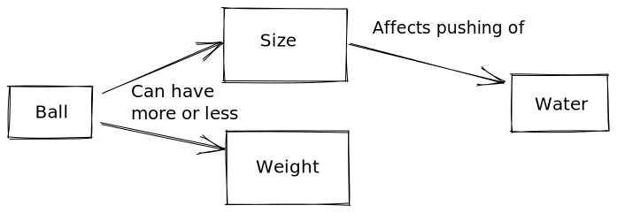

::::::::::::::::::::::::::::::::::::::: objectives

- Compare and contrast the three stages of skill acquisition.
- Identify a mental model and an analogy that can help to explain it.
- Apply a concept map to explore a simple mental model.
- Understand the limitations of knowledge in the absence of a functional mental model.
- Create a formative assessment to diagnose a broken mental model.

::::::::::::::::::::::::::::::::::::::::::::::::::

:::::::::::::::::::::::::::::::::::::::: questions

- How do people learn?
- Who is a typical Carpentries learner?
- How can we help novices become competent practitioners?

::::::::::::::::::::::::::::::::::::::::::::::::::

We will now get started with a discussion of how learning works. We will begin with
some key concepts from educational research and identify how these principles
are put into practice in Carpentries workshops.

## The Carpentries Pedagogical Model

The Carpentries aims to teach computational competence to learners. We take an applied approach, avoiding the theoretical and general
in favor of the practical and specific. By showing learners how to solve specific problems with specific tools and providing hands-on
practice, we develop learners' confidence and lay the foundation for future learning.

A critical component of this process is that learners are able to practice what they are learning in real time, get
feedback on what they are doing, and then apply those lessons learned to the next step in the learning process. Having
learners help each other during the workshops also helps to reinforce concepts taught during the workshops.

**A Carpentries workshop is an interactive event** -- for learners and instructors. We give and
receive feedback throughout the course of a workshop. We incorporate assessments within the lesson materials and
ask for feedback on sticky notes during lunch breaks and at the end of each day.

One reason why practice and feedback are so important is because a Carpentries workshop is not simply a source of information;
it is the starting point for development of a new skill. To understand what this means, we will start by exploring what
research tells us about skill acquisition and development of a "mental model."

## The Acquisition of Skill

Our approach is based on the work of researchers like Patricia Benner,
who applied the [Dreyfus model of skill acquisition][wikipedia-dreyfus-skill]
in her studies of
[how nurses progress from novice to expert][nurses-dreyfus]
([see also books by Benner][Benner-dreyfus]). This work indicates that
through practice and formal instruction, learners acquire skills and advance through distinct stages. In simplified form, three stages of this model are:

{alt='Three people, labeled from left to right as "Novice", "Competent Practitioner", and "Expert". Underneath,an arrow labelled "Experience level" points from left to right. The "Novice" is quoted, "I am not sure what questions to ask." The Competent Practitioner is quoted, "I am pretty confident, but I still look stuff up a lot!" The Expert is quoted "I have been doing this on a daily basis for years!"'}

- *Novice*: someone who does not know what they do not know, i.e.,
  they do not yet know what the key ideas in the domain are or how they relate.
  Novices may have difficulty formulating questions, or may ask questions that seem irrelevant or off-topic
  as they rely on prior knowledge, without knowing what is or is not related yet.
  
  > Example: A *novice* learner in a Carpentries workshop might never have heard of the bash shell, and therefore
  > may have no understanding of how it relates to their file system or other programs on their computer.

- *Competent practitioner*: someone who has enough understanding for everyday purposes. They will not know all the details
  of how something works and their understanding may not be entirely accurate, but it is sufficient for completing normal
  tasks with normal effort under normal circumstances.
  
  > Example: A *competent practitioner* in a Carpentries workshop might have used the shell before and understand how to
  > move around directories and use individual programs, but they might not understand how they can fit these programs
  > together to build scripts and automate large tasks.

- *Expert*: someone who can easily handle situations that are out of the ordinary.
  
  > Example: An *expert* in a Carpentries workshop may have experience writing and running shell scripts and, when
  > presented with a problem, immediately sees how these skills can be used to solve the problem.

Note that how a person *feels* about their skill level is not included in these definitions! You may or may not
consider yourself an expert in a particular subject, but may nonetheless function at that level in certain contexts.
We will come back to the expertise of the Instructor and its impact -- positive and negative --
on teaching, in the next episode.
For now, we are primarily concerned with novices,
as this is The Carpentries' primary target audience.

It is common to think of a novice as a sort of an "empty vessel" into which knowledge can be "poured." Unfortunately, this analogy includes inaccuracies that can generate dangerous misconceptions. In our next section, we will briefly explore
the nature of "knowledge" through a concept
that helps us differentiate between novices and competent practitioners in a more useful and visual way. This, in turn, will have implications
for how we teach.

## Building a Mental Model

:::::::::::::::::::::::::::::::::::::  testimonial

All models are wrong, but some are useful.

- George Box, statistician
  

::::::::::::::::::::::::::::::::::::::::::::::::::

Understanding is never a mirror of reality, even for an expert; rather, it is
an internal representation based on our experience with a subject.
This internal representation is often described as a **mental model**. A mental model
allows us to extrapolate, or make predictions beyond and between the narrow limits of experience and memory, filling in
gaps to the point that things "make sense."

As we learn, our mental model evolves to become more complex and, most importantly, more useful. A useful model makes reasonable predictions and fits well within
the range of things
we are likely to encounter. While there will always be inaccuracies -- or "misconceptions" -- these do not interfere with day-to-day functioning.
A useful model does not seize up or break down entirely as new concepts are added.

### The power (and limitations) of analogies

Some mental models can be succinctly summarized by comparison to something else that is more universally understood.  Good analogies can be extraordinarily useful when teaching,
because they draw upon an existing mental model to fill in another, speeding learning and making a memorable connection. However, all analogies have limitations!
If you choose to use an analogy, be sure its usefulness outweighs its potential to generate misconceptions that may interfere with learning.

:::::::::::::::::::::::::::::::::::::::  challenge

## Analogy Brainstorm

1. Think of an analogy to explore. Perhaps you have a favorite that relates to your area of professional interest, or a hobby. If
  you prefer to work with an example, consider this common analogy from education: "teaching is like gardening."
2. Share your analogy with a partner or group. (If you have not yet done so, be sure to take a moment to introduce yourself, first!) What does your analogy
  convey about the topic? How is it useful? In what ways is it wrong?

This activity should take about 10 minutes.


::::::::::::::::::::::::::::::::::::::::::::::::::

:::::::::::::::::::::::::::::::::::::::::  callout

## Analogies at Work: "Software Carpentry"

People often ask where our name came from. Greg Wilson has this to say:

"Brent Gorda and I came up with the name in 1998 to differentiate what we were teaching from software engineering. That's about digging the Channel Tunnel;
we're about the computational equivalent of hanging drywall."

The word "carpentry" acts as a metaphor -- a type of analogy -- inspiring a comparison with something concrete,
hands on, practical, and useful. This clearly conveys the purpose of our organization: to support computational skill development
among working practitioners who need the right tools and practices to be effective day to day.


::::::::::::::::::::::::::::::::::::::::::::::::::

A mental model may be represented as a collection of concepts and facts, connected by relationships.
The mental model of an expert in any given subject will be far larger and more complex than that of a novice, including both more concepts
and more detailed and numerous relationships. However, **both may be perfectly useful** in certain contexts.

Returning to our example levels of skill development:

- A *novice* has a minimal mental model of surface features of the domain. Inaccuracies based on limited prior knowledge may interfere with adding new information.
  Predictions are likely to borrow heavily from mental models of other domains
  which seem superficially similar.
- A *competent practitioner* has a mental model that is useful for everyday purposes. Most new information
  they are likely to encounter will fit well with their existing model. Even though many potential elements of their mental model may
  still be missing or wrong, predictions about their area of work are usually accurate.
- An *expert* has a densely populated and connected mental model that is especially good for problem solving.
  They quickly connect concepts that others may not see as being related. They may have difficulty
  explaining how they are thinking in ways that do not rely on other features unique to their own mental model.

{alt='Three collections of six circles. The first collection is labelled "Novice" and has only two arrows connecting some of the circles. The second collection, labelled "Competent Practitioner" has six connecting arrows. The third collection, labelled "Expert", is densly connected, with eight connecting arrows.'}

### Mapping a Mental Model
:::::::::::::::::::::::::::::::::::::::  instructor
People often request to see more examples of concept maps. These are some examples linked from a previous version of the curriculum:

- [Array Math](fig/array-math.png)
- [Conditionals](fig/conditionals.png)
- [Creating and Destroying Files](fig/create-destroy.png)
- [Sets and Dictionaries in Python](fig/dict-set.png)
- [Input and Output](fig/io.png)
- [Lists and Loops](fig/lists-loops.png)
- [Git Version Control](fig/git_concept_map.png)

Most of these are much larger than our recommended limit for the activity. It can be helpful to make a larger map and then narrow down to a smaller one.

::::::::::::::::::::::::::::::::::::::::::::::::::

Most people do not naturally visualize a mental model as a diagram of concepts and relationships. Mental models are complicated!
Yet, visual representation of concepts and relationships can be a useful way to explore and understand hidden features of a mental model.

There are certain ways in which you may routinely use visual organizers, such as
flow charts or biochemical pathway diagrams. A more general tool that is useful for exploring any network of concepts and relationships is a **concept map**. Pioneered for
classroom use by John Novak in the 1970s, a concept map asks you to identify which concepts are most relevant to a topic at hand and -- critically -- to
identify how they are connected. It can be quite difficult to identify and organize these connections! However, the process of forcing abstract knowledge into a visual
format can force you to name connections that you might otherwise have quietly assumed, or illuminate gaps that you may not have been aware of. Especially where analogies are not available, concept mapping can help
you to make your mental model of a concept more clear to yourself or others.

As an example, consider a mental model of the relationship between a small ball and water in a full glass.

The concept map below illustrates a simple mental model that a young child might develop after putting the ball in the water.

{alt='Two words inside rectangles, with labeled arrows connecting them. "Ball" is at the left, with an arrow pointing to "Water", at right, labeled as "Pushes out."'}

Give a child balls of three different sizes, and they might put together a somewhat more complex mental model,
perhaps illustrated as:

{alt='Four words inside rectangles, with labeled arrows connecting them. "Ball" is at the left, and "Water", at right. "Big Ball" and "Small Ball" are stacked vertically between them. Arrows from "Ball" are labeled "can be MORE" and can be "LESS", and arrows to "water" are labeled as "Pushes out MORE" and "Pushes out "LESS"'}

:::::::::::::::::::::::::::::::::::::::  challenge

## Mapping a Mental Model

1) On a piece of paper, draw a simplified concept map of the same concept you discussed in the last activity, but this time without the analogy.
  What are 3-4 core
  concepts involved? How are those concepts related? (Note: if you would like to try out an online tool for this exercise, visit [https://excalidraw.com](https://excalidraw.com) .)

2) In the Etherpad, write some notes on this process. Was it difficult? Do you think it would be a useful exercise prior to teaching about your topic?
  What challenges might a novice face in creating a concept map of this kind?  
  This exercise should take about 5 minutes.
  

::::::::::::::::::::::::::::::::::::::::::::::::::

## Misconceptions

The mental model above connects a ball to the water it can displace, recognizing that 'more' ball can move 'more' water. This mental model is perfectly functional for a child who wants to have fun splashing water around.
It may endure in this way for several years of beaches and bathtubs.

However, when this child is asked to predict what would happen to the water if a ball were not bigger or smaller but *heavier* or *lighter*, they will naturally apply their existing mental model to the task.
BUT...

{alt='A concept map similar to the previous one except with "Heavy Ball" and "Light Ball" in the middle, and a red "X" over the arrows labeled "Pushes out MORE" and "Pushes out LESS"'}

What a surprise! The challenge presented by this new information is that it clashes with the pre-existing mental model, to which it seemed to apply. This prior knowledge needs to be adjusted to a new understanding that incorporates the difference between properties of mass and volume.

{alt='A new concept map. "Ball" remains at left, and "Water", at right. "Size" and "Weight" are stacked vertically between them. Arrows from "Ball" share the label "Can have more or less." One arrow from "size to "water" is labeled "Affects pushing of"'}

When mental models break, learning can occur more slowly than you might expect. The longer a prior model was in use, and the more extensively it has to be *unlearned*, the more it can actively interfere with the incorporation of new knowledge. Our child may quickly adapt to this new information if they had never thought much about mass before and were simply trying out an existing mental model on a new situation. However, if they had extensive experience with balls that were both larger and heavier (for example), it may take longer to unlearn what they thought they understood about mass.

Most mental models worth mapping are not so simple. Yet, forcing complex ideas in to this simplified format can be useful when preparing to teach, because
it forces you to be explicit about exactly what concepts are at the heart of your topic, and to name relationships between them.

### Types of Misconceptions

Correcting learners' misconceptions is at least as important as presenting them with correct information.
There are many ways of classifying different types of misconceptions. For our purposes, it is useful to consider
3 broad categories:

- Simple *factual errors*. These exist in isolation from any deeper understanding.
  These are the easiest to correct. Example: believing that Vancouver is the capital of British Columbia.
- *Broken models*. These occur when inaccuracies explain relationships and generate predictions (often successfully!) in an existing mental model.
  These take time to address, demanding that learners reason carefully through examples to see contradictions.
  Examples: believing that motion and acceleration must always be in the same direction, or that seasons are related to the shape of the earth's orbit.
- *Fundamental beliefs*, which are deeply connected to a learner's social identity
  and are the hardest to change. Examples: "the world is only a few thousand years old"
  or "human beings cannot affect the planet's climate". "I am not a computational person" may, arguably, also fall into this category of misconception.

The middle category of misconceptions is the most useful type to watch out for in Carpentries workshops.
While teaching, we want to expose learners' broken models so that we can help them begin to deconstruct them and build better ones in their place.

:::::::::::::::::::::::::::::::::::::::  challenge

## Anticipating Misconceptions

Describe a misconception you have encountered as a teacher or as a learner.

This exercise should take about 5 minutes.


::::::::::::::::::::::::::::::::::::::::::::::::::

## Using Formative Assessment to Identify Misconceptions

In order to effectively root out pre-existing misconceptions
that need to be un-learned and stop quietly developing
misconceptions in their tracks, an Instructor needs to be actively and persistently looking for them. But how?

Like so many challenges we will discuss in this training, the answer is **feedback**. In this case, we want feedback
that allows us to **assess** the developing mental model of a trainee in highly specific ways, to verify that learning
is proceeding according to plan and not careening off in some unpredicted direction. We want to get this feedback **while we teach**
so that we can respond to that information and adapt our instruction to get learners back on track.

This kind of assessment has a name: it is called **formative assessment** because it is applied during learning to form
the practice of teaching and the experience of the learner. This is different from exams, for example,
which sum up what a participant has learned but are not used to guide further progress
and are hence called **summative**.

Feedback from formative assessment illuminates misconceptions for both Instructors and learners. It also provides
reassurance on both sides when learning *is* proceeding on track! It is far more reliable than reading faces
or using feelings of comfort as a metric, which tends to be what Instructors and learners default to
otherwise.

:::::::::::::::::::::::::::::::::::::::  challenge

## Formative Assessments

Any instructional tool that generates feedback that is used in a formative way can be described as "formative assessment."
Based on your previous educational experience (or even this training so far!)
what types of formative assessments do you know about?

Write your answers in the Etherpad; or go around and have each person in the group name one.

This exercise should take about 5 minutes.


::::::::::::::::::::::::::::::::::::::::::::::::::

Formative assessments can serve many purposes other than hunting down misconceptions, such as verifying
engagement or supporting memory consolidation. We will discuss some of these functions
in later episodes. In this section, we are interested quite narrowly in evaluating mental models.

One example of formative assessment that can be used to tease out misconceptions is
the multiple choice question (MCQ).
When designed carefully,
these can target anticipated misconceptions with surgical precision.
For example,
suppose we are teaching children multi-digit addition.
A well-designed MCQ would be:

```source
Q: what is 27 + 15 ?
a) 42
b) 32
c) 312
d) 33
```

The correct answer is 42,
but each of the other answers provides valuable insight.

:::::::::::::::::::::::::::::::::::::::  challenge

## Identify the Misconceptions

Choose one wrong answer and write in the Etherpad what misconception is associated with that wrong answer.
This discussion should take about 5 minutes.

:::::::::::::::  solution

## Solution

- If the child answers 32, they are throwing away the carry completely.
- If they answer 312, they know that they cannot just discard the carried '1',
  but do not understand that it is actually a ten
  and needs to be added into the next column.
  In other words,
  they are treating each column of numbers as unconnected to its neighbors.
- If they answer 33 then they know they have to carry the 1,
  but are carrying it back into the same column it came from.
  
  

:::::::::::::::::::::::::

::::::::::::::::::::::::::::::::::::::::::::::::::

Each of these incorrect answers has **diagnostic power**
Each answer looks like it could be right:
silly answers like "a fish!" offer therapeutic comedy but do not provide insight; nor do answers that
are wrong in random ways.
"Diagnostic power" means that each of the wrong choices helps the instructor figure out
precisely what misconceptions learners have adopted when they select that choice.

Formative assessments are most powerful when:

1. **all learners** are effectively assessed (not only the most vocal ones!) AND
2. an **instructor responds promptly to the results of the assessment**

An instructor may learn they need to change their pace or review a particular concept.
Using formative assessment effectively to discover and address misconceptions
is a teaching skill that you can develop with reflective practice.

:::::::::::::::::::::::::::::::::::::::  challenge

## Handling Outcomes

Formative assessments allow us as instructors to adapt our instruction to our audience.
What options do we have if a majority of the class chooses:

1. mostly one of the wrong answers?
2. mostly the right answer?
3. an even spread among options?

Choose one of the above scenarios and compose a suggested response to it in the Etherpad.

This discussion should take about 5 minutes.

:::::::::::::::  solution

## Solution

1. If the majority of the class votes for a single wrong answer, you have a widespread misconception
  and can stop to examine and correct that misconception.
2. If most of the class votes
  for the right answer, it is ok to explain the answer and move on. Helpers can make
  themselves available to assist anyone who still feels uncertain.
3. If answers are pretty evenly
  split between options, learners may be guessing randomly, reflecting an
  absent mental model rather than a broken one. In this case it is a good
  idea to go back to a point where everyone was on the same page.
  
  

:::::::::::::::::::::::::

::::::::::::::::::::::::::::::::::::::::::::::::::

Designing a few MCQs with diagnostic power is useful
when preparing to teach even if they are never used, for the same reason that concept
mapping can be useful: it forces the instructor to think about the learners' mental models
and try to anticipate how they might be broken. In short, it helps Instructors
to put themselves into the learners' heads
and see the topic from their point of view. We will talk more about the process of preparing to teach
in a later episode.

## The Importance of Going Slowly

It takes work to actively assess mental models throughout a workshop; this also takes time. This
can make Instructors feel conflicted about using formative assessment routinely. However, the need to
conduct routine assessment is not the only reason why a workshop **should proceed more slowly than you think**.

One key insight from research on cognitive development is that
novices, competent practitioners, and experts each need to be taught differently.
In particular,
presenting novices with a pile of facts early on is counter-productive,
because they do not yet have a model or framework to fit those facts into.
In fact,
**presenting too many facts too soon can actually reinforce
an incorrect mental model**. (This is a key problem with the "empty vessel" analogy described earlier.)

Most learners coming to Carpentries lessons are novices,
and do not have a strong mental model of the concepts we are teaching.
Thus, our primary goal is **not**
to teach the syntax of a particular programming language, but **to help them construct a working mental model**
so that they have something to attach facts to. In other words, our goal is to teach people **how to think** about programming and data
management in a way that will allow them to learn more easily on their own or understand what they might find online.

:::::::::::::::::::::::::::::::::::::  testimonial

If someone feels it is too slow, they will be a bit bored. If they feel it is too fast, they will never come back to programming.
— Kunal Marwaha, SWC Instructor


::::::::::::::::::::::::::::::::::::::::::::::::::

If our goal is to help novices construct an accurate and useful mental model of a new intellectual domain,
this will impact our teaching. For example, we principally want to help learners
form the right categories and make connections among concepts.  We *do not*
want to overload them with a slew of unrelated facts, as this will be confusing.

An important practical implication of this latter point is the pace at which we teach.  
In the first main episode of Software Carpentry's [lesson on the Unix shell][swc-shell-novice],
which covers "Navigating Files and Directories", there are only four "commands"
for 40 minutes of teaching. Ten minutes per command may seem glacially slow,
but that episodes's real purpose is to teach learners about paths; later on,
they will learn about history, wildcards, pipes and filters,
command-line arguments, redirection,
and all the other big ideas on which the shell depends,
and without which people cannot understand how to use commands.

That mental model of the shell also includes things like:

- Anything you repeat manually, you will eventually get wrong
  (so let the computer repeat things for you by using tab completion
  and the `history` command).
- Lots of little tools, combined as needed, are more productive than
  a handful of programs.
  (This motivates the pipe-and-filter model.)

These two examples illustrate something else as well.
Learning consists of more than "just" adding information to mental models;
creating linkages between concepts and facts is at least as important.
Telling people that they should not repeat things,
and that they should try to think (by analogy) in terms of little pieces loosely joined,
both set the stage for discussing functions.
Explicitly referring back to pipes and filters in the shell when introducing functions
helps solidify both ideas.

:::::::::::::::::::::::::::::::::::::::::  callout

## Meeting Learners Where They Are

One of the strengths of Carpentries workshops is that we meet learners *where they are*. Carpentries Instructors
strive to help learners
progress from whatever starting point they happen to be at, without making anyone
feel inferior about their current practices or skillsets. We do this in part by teaching relevant and useful skills,
building an inclusive learning environment, and continually getting (and paying attention to!) feedback
from learners. We will be talking in more depth about each of these strategies as we go forward in our workshop.


::::::::::::::::::::::::::::::::::::::::::::::::::

[wikipedia-dreyfus-skill]: https://en.wikipedia.org/wiki/Dreyfus_model_of_skill_acquisition
[nurses-dreyfus]: https://journals.sagepub.com/doi/10.1177/0270467604265061
[Benner-dreyfus]: https://www.worldcat.org/search?q=au%3ABenner%2C+Patricia+E.
[swc-shell-novice]: https://swcarpentry.github.io/shell-novice/


:::::::::::::::::::::::::::::::::::::::: keypoints

- Our goal when teaching novices is to help them construct useful mental models.
- Exploring our own mental models can help us prepare to convey them.
- Constructing a useful mental model requires practice and corrective feedback.
- Formative assessments provide practice for learners and feedback to learners and instructors.

::::::::::::::::::::::::::::::::::::::::::::::::::


