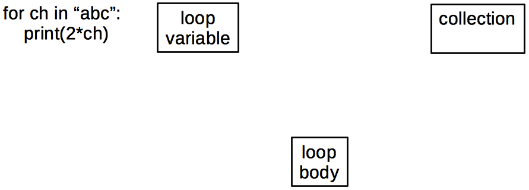
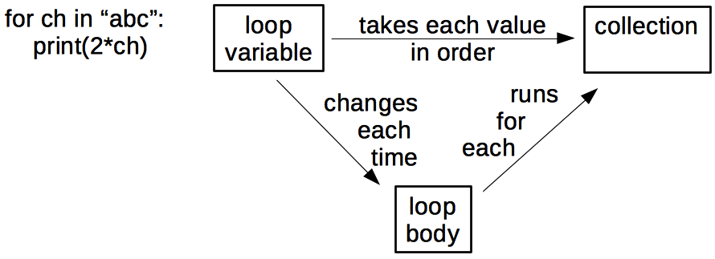
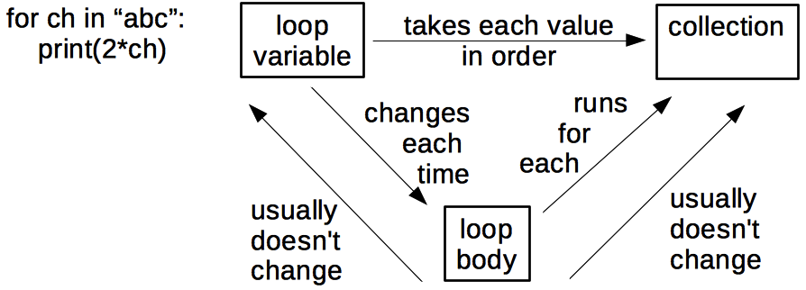

In our final topic in how people learn (and therefore, how we can be more
effective instructors), we'll be learning more about human memory:
specifically, how to remove unnecessary "load" in order to facilitate learning.

## Types of Memory

Learning involves memory. For our purposes, human memory can be divided into two different
layers.
The first is called *long-term*.
It is where we store  persistent information like our passwords and our home address.
It is essentially unbounded
(barring injury or disease, we will die before it fills up)
but it is slow to access.

Our second layer of memory is called *short-term*. This is the
type of memory you use to actively think about things and is often called working memory. It is much faster, but also much
smaller: in 1956, George Miller estimated that the average adult's short-term memory could hold
[7±2 items][wikipedia-7] for a few seconds before things started to drop out.
This is [why phone numbers are typically 7 or 8 digits long][phone-nums]:
back when phones had dials instead of keypads,
that was the longest sequence of numbers most adults could remember accurately
for as long as it took the dial to go around and around.

More recent research suggests that short-term memory is actually even smaller than this.
Regardless of its exact size, which may differ across people and contexts, we know that
short-term memory is limited. This has important implications for teaching. If we present
our learners with large amounts of information, without giving them the opportunity to
practice using it (and thereby transfer it into long-term memory), they won't retain
the material as well as if we present small amounts of information interspersed with
practice opportunities. This is yet another reason why going slowly and using
frequent formative assessment is important.

> ## Test Your Working Memory (5 min)
>
> [This website][memory-test] implements a short test of working memory.  
>
> Take 5 minutes to complete the exercise. What was your score? Write your answer
> in the Etherpad.
{: .challenge}

> ## Test Your Working Memory - Analog version (5 min)
>
> Read the following list and try to memorize the items in it:
>
> cat, apple, ball, tree, square, head, house, door, box, car, king,
> hammer, milk, fish, book, tape, arrow, flower, key, shoe
>
> Without looking at the list again, write down as many words from the list as
> you can. How many did you remember? Write your answer in the Etherpad.
{: .challenge}

Most people will have found they only remember 5-7 words. Don't worry if you
remembered fewer - many factors can affect short-term memory in different situations.
Fortunately, there are techniques that we can use to improve our effective short-term memory.
We'll illustrate one of these techniques and then describe how this is applicable to our
workshops.  

## Strategies For Memory Management

Our role as instructors, therefore, is to help our learners by not flooding their
short term memory with too much information, partially by providing strategies
and exercises to help them form the connections that will move concepts into
long-term memory. What are some tools for doing this?

### Chunking

One is by explicitly forming connections or groupings.  
Our minds can store larger numbers of facts in short-term memory by creating *chunks*, or
relationships among separate items, causing them to be remembered as a single item.
For example, most of us will remember a word we read as a single item ("cat"), rather
than as a sequence of letters ("c-a-t").
Similarly, the pattern made by five spots on cards or die is remembered as a whole
rather than as five separate pieces of information.

> ## Improving Short-term Memory with Chunking
>
> Repeat the memory exercise you did earlier, but this time,
> try to form short stories or phrases, or a visual image, from the words you see.
>
> Write the number of words you remembered in the Etherpad.
> How does this compare with your first attempt?
{: .challenge}

Storing words in groups reduces the number of effective
items in your short-term memory, allowing you to keep
more information in your head at once. This is one reason
why helping our learners to see the connections among
the concepts we are teaching is so important.  

### Active Learning Through Formative Assessment

Formative assessment is a key component in helping learners solidify their understanding
and transfer ideas from short-term memory into long-term memory. It's important
to use formative assessments frequently to help learners transition new concepts
into their long-term memory, before their short-term memory fills up. It can
be helpful to use pedagogical planning tools to identify the number of concepts
that are being introduced in a lesson and plan where to include formative
assessments.

### Limit concepts

In the same vein as "going slowly," it's important to limit the number of
concepts introduced in a lesson; no matter how many exercises or formative
assessments you do, you can't overcome the limit of items that can be
shored in short-term memory.

## Concept Maps as Instructional Planning Tools

One tool that can be used to identify the number of concepts being
introduced in a lesson is the *concept map*.
A concept map is a picture of someone's mental model of a domain:
facts are bubbles,
and connections are labelled arcs.
It is important that they are labelled:
saying "X and Y are related" is only helpful if we explain what the relationship *is*.

To show what concept maps look like,
consider this example of a `for` loop in Python:

~~~
for ch in "abc":
    print(2*ch)
~~~
{: .source}

The three key concepts used in this loop are:



The key relationships,
which are as important as the concepts themselves,
are:



A quick count shows that there are actually 6 things here,
not just 3,
so we're already brushing up against the limits of short-term memory.
If we add two more facts to show things that are usually (but not always) true:



the count rises to 8,
which is a good size for a single teaching episode.
A few other concept maps drawn by previous participants in this training course
are listed below:

* [Array Math](../fig/array-math.png)
* [Conditionals](../fig/conditionals.png)
* [Creating and Destroying Files](../fig/create-destroy.png)
* [Sets and Dictionaries in Python](../fig/dict-set.png)
* [Input and Output](../fig/io.png)
* [Lists and Loops](../fig/lists-loops.png)
* [Git Version Control](../fig/git_concept_map.png)
* [Library Carpentry Foundations](../fig/lc-foundations.png)

Most of these are much larger than our recommended limit,
but that's not necessarily a bad thing. An instructor can
draw a concept map for an entire topic,
and use that to decide where to introduce a formative assessment to avoid overloading
short-term memory.

It's very important to use a technique like concept mapping for a lesson
before teaching it - an instructor needs to identify just how many pieces of
separate information will need to be "stored" in memory during each part of the lesson. This
can be particularly useful for experts who are trying to unpack their own
knowledge.

> ## Concept Mapping
>
> Create a hand-drawn concept map for a part of a Carpentry lesson you would teach in
> five minutes (i.e.
> the amount of material you would teach before doing a formative assessment).
> You can use the same subject about which you created a multiple choice question, or
> a different subject.
> Trade with a partner, and critique each other's maps. Are there any concepts
> missing in your partner's map that you would include? Are there more than a handful
> of concepts in your map? If so, how would you re-divide those concepts to avoid
> overwhelming your learners' short-term memory?
>
> Take 10 minutes to draw the concept maps and share with your neighbor.
> Write "*done*" in the Etherpad chat once you have finished.
{: .challenge}

> ## Other Uses of Concept Maps
> In addition to helping you plan where to introduce formative assessments, concept maps can
> be used in many other ways:
>
> 1.  To aid solo design of a lesson by helping authors figure
> out what they're trying to teach.
> 2.  To aid communication with fellow lesson designers.
> 3.  To aid communication with learners.
>     While it's possible to give learners a pre-drawn map at the start of a lesson for them
> to annotate, it's better to draw it piece by piece while teaching
> to reinforce the ties between what's in the map and what the instructor said.
> 4. Concept maps can be used as a classroom discussion exercise.
> 	Put learners in small groups (2-4 people each),
>	give each group some sticky notes on which a few key concepts are written,
>	and have them build a concept map on a whiteboard by placing those sticky notes,
>	connecting them with labelled arcs,
>	and adding any other concepts they think they need.
> 5.  Concept maps are also a useful formative assessment technique:
>    having learners draw concept maps of what they think they just
> heard shows the instructor what was missed and what was misunderstood.
{: .callout}

## Why Guided Practice is Important

Another way to think about the challenge of managing memory is through
the theory of *[cognitive load][wikipedia-cognitive-load]*.
It posits that people have to deal with three things when they're learning:

*   *Intrinsic* load is what they have to keep in mind in order to carry out a learning task.
*   *Germane* load is the (desirable) mental effort required to create linkages between new information and old
    (which is one of the things that distinguishes learning from memorization).
*   *Extraneous* load is everything else that distracts or gets in the way.

Cognitive load theory's proponents claim that eliminating extraneous cognitive load accelerates learning. One
way to do this is by using *guided practice*: we set up a structure in which learners can
apply their skills with direction and get feedback on their progress.

> ## Why We Don't Use Minimal Guidance
>
> An alternative to guided practice is a *minimal guidance* approach, where
> learners are given raw materials (for example a text or reference) and
> asked to explore and learn to solve problems on their own.
> Minimal guidance practice comes from another teaching strategy
> variously known as *constructivist*, *discovery*, *problem-based*, *experiential*
> or *inquiry-based* learning.
>
> You may have heard of some of these strategies, and they are not without
> merit! But they frequently fall flat. Cognitive load theory, introduced by [Kirshner et al.][kirschner-paper] 
> in response to the popularity and uneven success of these approaches, applies what we know about
> human cognitive architecture to understand why minimal guidance often fails.
>
> Minimally-guided instruction requires learners to simultaneously
> master a domain's factual content
> and its search and problem-solving strategies.
> Fostering creativity and independence is intuitively appealing,
> but that doesn't mean it works.
{: .callout}

In the framework of cognitive load, some additional predictions can be made.

One example is work by Mayer and colleagues on
the *[split-attention effect][wikipedia-split-attention]*.
Linguistic and visual input are processed by different parts of the human brain,
and linguistic and visual memories are stored separately as well.
This means that correlating different linguistic, auditory, and visual
streams of information takes cognitive effort:
when someone reads one thing while hearing something else spoken aloud,
their brain can't help but check that it's getting the same information on both channels.
Discrepancies between these channels increase cognitive load and decrease learning.
Learning is therefore more effective when information that is being presented simultaneously
in two different channels is redundant, rather than different.

For our workshops, this means the instructor should say out loud commands as they type them on the screen while engaging learners in [participatory live coding]({{ page.root }}/14-live/).

## Guided Practice at Work

How do we implement guided practice, lessening the burden of extraneous
cognitive load and allow people to focus on what's important?  There are
many different types of exercises that implement this guided practice; some
are listed in this [blog post by Greg Wilson][GW-exercise-post], including
Parson's Problems and labelling diagrams.

To learn more about a specific guided practice exercise
called *faded examples*, read on.

According to cognitive load theory,
searching for a solution strategy is an extra burden
on top of applying that strategy.
We can therefore accelerate learning
by giving learners worked examples that show them a problem and a detailed step-by-step solution,
followed by a series of faded examples.
The first of these presents a nearly-complete use of the same problem-solving strategy
with a small number of blanks for the learner to fill in.
The next problem is also of the same type,
but has more blanks,
and so on until the learner is asked to solve the entire problem.

Faded examples work because they introduce the problem-solving strategy piece by piece.
At each step,
learners have one new problem to tackle.
This is less intimidating than a blank screen or a blank sheet of paper.
It also encourages learners to think about the similarities and differences between various approaches,
which helps create the linkages in the mental model that instructors want them to form.

For example,
someone teaching Python might start by explaining this:

~~~
def total_length(words):
    """Returns the total length of all words in a list combined.

    Example:
       total_length(["red", "green", "blue"]) => 12
    """
    total = 0
    for word in words:
        total += len(word)
    return total
~~~
{: .python}

then ask learners to fill in the blanks in:

~~~
def word_lengths(words):
    """Returns a list of lengths of each word in a list.

    Example:
        word_lengths(["red", "green", "blue"]) => [3, 5, 4]
    """
    lengths = ____
    for word in words:
        lengths ____
    return lengths
~~~
{: .python}

The next problem might be:

~~~
def concatenate_all(words):
    """Combines all words in a list into one.

    Example:
        concatenate_all(["red", "green", "blue"]) => "redgreenblue"
    """
    result = ____
    for ____ in ____:
        ____
    return result
~~~~
{: .python}

and learners would finally be asked to tackle:

~~~
def acronymize(words):
    """Returns the first letter of each word in a list capitalised in a single string.

    Example:
        acronymize(["red", "green", "blue"]) => "RGB"
    """
    ____
~~~
{: .python}

Another situation in which a concept map can be helpful is in deciding where to place the
blanks in a faded example. Each blank (or set of blanks) would ideally correspond to one
concept in your concept map.

> ## Create a Faded Example from a Lesson (Optional)
>
> The following exercise should be done in groups of 2-3.
>
> 1.  Pick a block of code from an existing Carpentries lesson,
>     or from another lesson you have taught recently.
> 2.  Replace 2-3 pieces of the code with a blank.
> 3.  Write a question to test the learner's ability to correctly fill in that blank.
> 5.  Paste your faded example in the Etherpad.
>
> This exercise should take about 10 minutes.
>
>> ## Solution
>>
>> Your solution to this exercise could look similar to the example
>> given above, or something like this:
>>
>> **Question**  
>> In this example, we will graph the change in life expectancy over time
>> as a line graph, giving each country a unique color and each continent
>> its own unique panel or facet.  
>> What would you add to the blank spaces to create this graph?
>>```
>> ggplot(data = az.countries, aes(x = year, y = lifeExp, color = ________)) +
>>   geom_line() +  facet_wrap( ~ _______)
>>```
>>
>>**Answer** `country` and  `continent`
>>
>{: .solution}
{: .challenge}

## Summary
The process of learning is constrained by the limits of short-term memory. In order to move
new information into long-term memory, it must be actively applied, but activities that
make excessive demands on short-term memory are likely to induce cognitive overload and can
easily harm learner motivation. Instructional tools that expand short-term memory by
increasing connectivity (chunking) among new concepts can improve
outcomes for subsequent memory-intensive exercises. Formative assessments, when performed
frequently, help learners by prompting them to apply new content before it has been
overwritten. Faded examples or other types of guided practice
both minimize demands on short-term memory and offer context that
helps improve connectivity for future work, in which the "scaffolding" of contextual support
can be gradually removed.
Anything you can do to a) recognize and b) support learners in working with the
limitations of short-term memory will improve the effectiveness of your teaching.

[kirschner-paper]: http://www.cogtech.usc.edu/publications/kirschner_Sweller_Clark.pdf
[memory-test]: https://miku.github.io/activememory/
[wikipedia-cognitive-load]: https://en.wikipedia.org/wiki/Cognitive_load
[wikipedia-inquiry]: https://en.wikipedia.org/wiki/Inquiry-based_learning
[wikipedia-split-attention]: https://en.wikipedia.org/wiki/Split_attention_effect
[wikipedia-7]: https://en.wikipedia.org/wiki/The_Magical_Number_Seven,_Plus_or_Minus_Two
[phone-nums]: https://www.quora.com/Why-did-Bell-Labs-create-phone-numbers-of-7-digits-10-digits
[GW-exercise-post]: http://third-bit.com/2017/10/16/exercise-types.html
