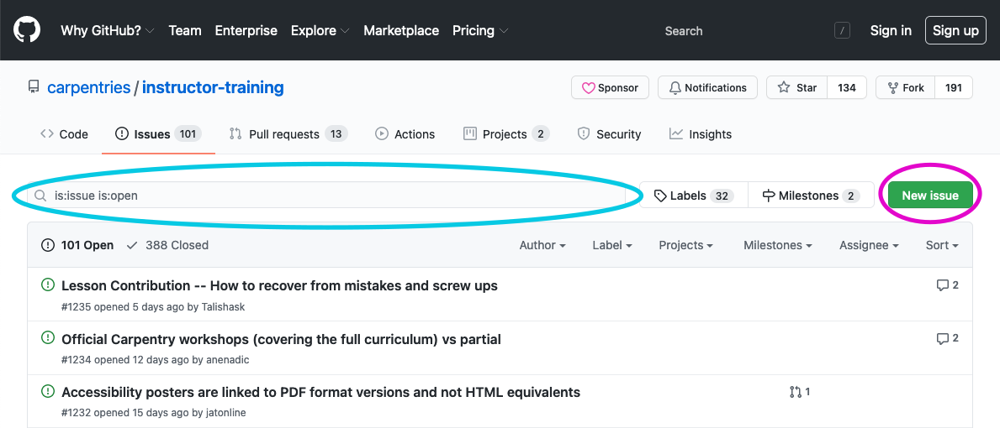

In this short episode, we will take a moment to review the actions you will
need to take after this training to become a fully certified Carpentries Instructor.  

## Instructor Checkout

After completing the Instructor Training workshop, there are three final steps to complete before qualifying as an Instructor. 
Briefly, the three steps are:

1.  [Make (and send us a link to) a small contribution to a lesson or glossary]({{ page.root }}/14-checkout/#1-lesson-contributions).
2.  [Take part in an online community discussion session]({{ page.root }}/14-checkout/#2-community-discussion).
3.  [Take part in an online teaching demonstration session]({{ page.root }}/14-checkout/#3-teaching-demonstration).

All trainees have 3 months (90 days) from the end date of your training to complete checkout. If you need more time,
3-month extensions may be requested by emailing [checkout@carpentries.org](mailto: checkout@carpentries.org). 
Extensions may be granted for any reason up to 1 year from your training date.

> ## Be The Expert: Checkout Q & A
>
> In small groups, read and discuss one of the three checkout procedures described in this episode. (https://carpentries.github.io/instructor-training/20-checkout/index.html if you are viewing this exercise in the Etherpad)
> Make notes in the Etherpad:
> - What points do you think it is most important or helpful for people to remember?
> - What questions or points of confusion do you have, or think others might have? 
> When you are done, report back to the full group about that stage of the process.
>
> This exercise should take about 10 minutes.
{: .challenge}

## 1. Lesson Contributions

### Keep It Simple!

**The purpose of the lesson contribution is to demonstrate that you are prepared to draw upon your experience teaching Carpentries lessons to
contribute towards their maintenance and improvement in the future.** For this reason, we suggest starting small! Consider commenting
on an existing issue, fixing a typo if you find one, or contributing a single term to our multilingual glossary. If you would like
to help us out with something more substantial, consider selecting an item from our [Help Wanted page][help-wanted]. 

### What is an Issue? GitHub 101
The curriculum for this workshop, like all Carpentries curricula, is hosted on GitHub. This gives you access to a 'back room' where the code for the 
curriculum website is freely available, suggestions for changes can be proposed, and conversations about potential changes can be held. 

The browser view of the GitHub repository for this workshop looks like this: 

There are two tabs on this page that offer opportunities for interaction with the community that maintains this curriculum. The first is the "Issues" tab. 
When someone has an idea or suggestion, they can start a conversation about their idea by creating an Issue. Others can then comment on the Issue to provide 
feedback. Issues can be searched, using the search bar at the top:

If you have an idea, it is a good idea to search first to see if anyone else has already suggested it! If so, you can add your thoughts as a comment 
on the existing issue instead of starting a new one. Either way, you will get credit for your contribution to the conversation. Note that you must be signed 
in to GitHub to be able to see the comment box at the bottom of each issue. 

If you find something that you know how to fix by changing the code of the lesson, you may instead wish to submit a Pull Request (PR). You can also view
and comment on existing PRs. We will not cover the details of how to create a PR, but there is a 
community-[contributed guide](https://github.com/dmgt/swc_github_flow/blob/master/for_novice_contributors.md) that can help. 

Each lesson repository has a document, named `CONTRIBUTING.md`, that outlines contribution guidelines. The one for this repository
is [here][contributing]. Maintainers for each repository may choose to customize their own guidelines.

### Alternatives to GitHub
All Carpentries curricula (including this one) are hosted on GitHub. Learning to interact on GitHub can have many benefits,
including the ability to contribute to other open-source projects! However, we understand that there are many
reasons why trainees may wish to avoid engaging on GitHub. That's ok!

For this checkout task, you may email your contribution to [checkout@carpentries.org](mailto: checkout@carpentries.org).
Be sure to include a link to the lesson or site that you are addressing in your contribution. A Carpentries Core Team member will 
add your contribution to the relevant repository on your behalf (e.g. by creating an issue), and will send you a link so that
you may view any responses by the maintainers. 

> ## Help Wanted: Breaking Down Barriers
>
> At The Carpentries, we know all too well that tools and technical procedures can present a serious barrier to progress. 
> That is why we exist! So we appreciate the irony when participation in our community demands tools or technical 
> procedures that may not be familiar or accessible to all who wish to contribute. GitHub, in particular is often recognized as an obstacle;
> this is something our community has [discussed extensively][git-blog].
>
> We are actively invested in making our processes as friendly and inclusive as possible, and that includes supporting our 
> community in surmounting the barriers presented by our own technologies of choice. Watch our channels for 
> opportunities to develop your skills as a contributor! In the mean time, if you
> have any ideas about how we can make our resources more contributor-friendly,
> please [let us know][contact-page].
{: .callout}

### Eligible Repositories
Contributions to repositories that are not managed by The Carpentries, including forks of Carpentries repositories, are **not** eligible for
checkout contributions. This is because The Carpentries Code of Conduct does not apply outside of Carpentries spaces. 

We recommend that contributions be directed to:
* any [Data Carpentry]({{ site.dc_site }}/lessons/), [Library Carpentry]({{ site.lc_site }}/lessons/), or [Software Carpentry]({{ site.swc_site }}/lessons/) lesson
* any [community developed lesson][carpentries-incubator]
* our open source, multilingual glossary of data science terms, [Glosario][glosario-github]

With the exception of Glossario, **please be cautious about proposing new content or exercises**. Most of our lessons are full to bursting! 
The greater challenge, in most cases, is identifying where and how to cut. 

### What Comes Next?
If you submit your own contribution, be sure to send an email with a link to [checkout@carpentries.org](mailto: checkout@carpentries.org). 
Pay attention to GitHub notifications in case the Maintainers or others have follow-up questions or 
requests. However, also keep in mind that Carpentries lesson Maintainers, like Instructors, are mostly volunteers! Some repositories are vigorously
maintained; others may have slower response times. Do not take it personally if your contribution does not get a prompt response.
**Your contribution does not need to be reviewed or accepted in order for you to become an Instructor**.

## 2. Community Discussion

The purpose of having you attend a Community Discussion is to introduce you to other members of our global community
and to demonstrate an ongoing resource for support and advice as you develop your teaching practice. 

Community Discussion meetings occur several times a week and may take different forms. The most common type of Community Discussion 
meeting is designed to support Instructors in preparing to teach an upcoming workshop and to provide a forum for sharing
lessons learned by those who have recently taught. If there are no workshops to discuss on the agenda, then the facilitator will 
lead a conversation about teaching and preparing to teach, engaging the interests of participants. These meetings are most often 
led by a member of the Instructor Development committee or The Carpentries Core Team.

In some cases, a Community Discussion meeting may be used for regional community-building, to invite the community to connect
with representatives from specific Carpentries committees or subcommunities, or to address a theme of special interest to our
community.

When signing up on the [Community Discussion Etherpad][discussion], be sure to examine the description of your event carefully. Also, **take care to double check
the time zone**, and mark your calendar after signing up! At the time of the event, the Zoom link may be found at the top
of the Etherpad.

> ## Carpentries Tools: Etherpad
>
> The Etherpad is a collaborative note taking tool that is widely used in Carpentries workshops and many other activities in the community.
> We also use Etherpads for sign-ups and notes on recurring events, like community discussions and teaching demonstrations.
> Most Etherpads for recurring events are linked from our ["pad of pads"][pad-of-pads].
> This is a great one to bookmark and use as a reference throughout your checkout process and as a newly minted member
> of The Carpentries community.
>
{: .callout}

### What Should I Say?
Joining a meeting to "discuss" teaching practices with strangers can feel a little intimidating! If you have enjoyed meeting the people at your Instructor Training 
workshop (we hear this a lot!) you will probably enjoy meeting people at your discussion session, too. 

Being prepared to participate does not mean you need to do any homework in advance! However, it can help to put a little thought into 
what questions you have about training. In case you need a little inspiration, here are a few themes to consider:
* distribution of teaching among the instructional team
* distribution of organisational responsibilities among the instructional team
* adaptations or modifications to curricular materials
* timing and pacing
* sticking points or challenges
* questions or concerns about the curricula  
* broader questions about the value or experience of teaching Carpentries workshops

### Community Discussions are Not Just for Checkout!
Community Discussion meetings are an excellent opportunity to
get help as you prepare to teach and to engage in vital reflection on your teaching practice while connecting with a community of like-
minded Instructors. You are invited to attend these at any time! If you think you might enjoy hosting them, or would like to help develop 
other opportunities for Instructors, consider joining the Instructor Development Committee. 

> ## Ongoing support
>
> Instructors are highly encouraged to participate in Community Discussions before and after each workshop they teach,
> so that they can continue to learn from each other and advance their teaching skills. To work more intensively on specific aspects of your teaching practice, consider
> participating in The Carpentries [Mentoring program][mentoring]!
{: .callout}

### In-Person and Virtual Alternatives
Occasionally, a special in-person Community Discussion event may be approved to occur in-person. This is most common in areas with limited internet
access or in association with larger events like conferences or extended workshops. In addition, Carpentries communities occasionally host conferences
virtually or in-person that invite you to form a deeper connection with your local or global Carpentries community. Registered in-person Community Discussion
meetings, CarpentryCon, and CarpentryConnect events are all eligible to satisfy the Community Discussion requirement. 

### Getting Credit
After each Community Discussion meeting, hosts submit a form that includes the names of attendees who identified themselves as
fulfilling their checkout requirement. This is indicated by writing "checkout" next to your name in the Etherpad. As long as you
indicate that you are completing checkout and attend the event you are signed up for, it is not necessary to email us after attending a standard
Community Discussion meeting.

If you attend an in-person meeting or a CarpentryCon/Connect event, please verify with your host if they plan to report checkout attendance. If you are
not sure whether your attendance has been reported, you can email us at [checkout@carpentries.org](mailto: checkout@carpentries.org) to confirm.

## 3. Teaching Demonstration

The teaching demonstration serves several purposes. First and foremost, it is an opportunity to **both give and receive feedback** on
a more polished presentation after you have had some time to reflect on your lesson and what you have learned in this workshop. In 
addition, it is an opportunity to **spend some time preparing a lesson** well in advance of your first workshop. This will ease your
preparations when the date of that workshop approaches. Finally, it is an opportunity to receive **feedback from a Carpentries 
Instructor Trainer** (like your Trainers at today's event), who will help make sure you are prepared for a strong start.

### Not a High Stakes Test
It can be nerve-wracking to perform in front of others! This is true when you teach, too. As much as possible, try to relax and
enjoy this friendly opportunity for feedback and connection with others in our community. Remember to embrace your mistakes!

In some cases, an Instructor Trainer may ask you to repeat your teaching demonstration another time prior to certification. If this
happens, they will be very clear about exactly what they would like you to change on your second appearance, and why. These requests
are made with your interests in mind -- we want you to be prepared for success when you set out to teach! 

Trainers draw from their own experience and training when they evaluate teaching demonstrations, but we do provide a 
[rubric][demos-rubric] for their reference. This can be a helpful resource as you prepare. 

### 1 Lesson = Several Episodes: preparing to teach a lesson.
For your teaching demonstration, you will prepare to teach **a complete lesson** from one of the
Carpentries lesson programs. Please refer to the lists of [Data Carpentry lessons]({{ site.dc_site }}/lessons/), [Library Carpentry lessons]({{ site.lc_site }}/lessons/), and [Software Carpentry lessons]({{ site.swc_site }}/lessons/) on the websites. 

A "lesson" corresponds to a single line in the lesson table and a single repository in GitHub.
(An example of a lesson: [R for Reproducible Scientific Analysis][r-gapminder].
Some lessons have supplementary modules.
You do not need to be prepared to teach the supplementary modules for your teaching demonstration.

**The Trainer hosting the teaching demonstration session may choose any episode of the lesson** from this [list of suggested episodes][start-points] for you to teach. (An 
example for an episode could be: [Data Structures][r-gapminder-episode]). Because we are particularly interested in your use of participatory live coding (or 
participatory work with spreadsheets etc.), you will not be asked to teach episodes that lack participatory content or that require files or other output from previous episodes.
other complications to set up.

**If your chosen lesson does not have any suggested episodes for start points listed or is not on the list, please consider choosing a different lesson.** 
Alternatively, if you
think your lesson has good start points for participatory instruction, you may email the Trainer hosting your demo to request advice on whether your lesson will
work for a checkout demo. Be sure to give yourself time to change course if your planned lesson will not work. 

### Sign-up and Set-up 
To sign up, select a session that works for you on the [the teaching demo schedule Etherpad]({{page.demopad}}), and add
your name and a link to your lesson of choice to the Etherpad. Be sure to **double check the time in your local time zone** by clicking on the converter 
link posted. Also, examine the demo description to ensure that it is not a special session targeting a specific sub-community or 
language (unless you are part of that target group). 

The link to connect to the video conference is at the top of the Etherpad. Your Trainer may send an email with confirmation and/or 
additional instructions prior to your demo. If possible, plan to use a headset with built in microphone for the best audio experience. 

### During the Demo
For your demonstration(s), you will screen-share and live code (or teach other participatory content) for 5 minutes. You may use whatever notes you want, but 
please do not display them on your screen. Teach as you would in an actual workshop.
When your five minutes are up, the Trainer leading the session will call time,
and then you and everyone else taking part in the session will give feedback on your teaching.
You will be asked to give feedback on yourself as well as on others;
your Trainer will likely recommmend a feedback structure using two axes of positive vs. negative
and content vs. presentation, just as you have done during this workshop.

### Languages Other than English
If you want to do your demonstration in a language other than English,
please let us know in advance so that we can attempt to find someone to moderate.
We may not be able to accommodate all languages.

### Getting Credit
After each teaching demonstration, Trainers submit a form that includes the names and passing status of each attendee. They will
also email you to let you know, as this information is typically not shared during the demo session. It is not necessary to email us 
after you have attended your teaching demonstration.

## 4. Tracking Your Progress
After you complete this workshop, your application will be matched to your training record and a profile will be created in The 
Carpentries database, AMY. If you already have a profile, [this link should take you to your profile][trainee-profile]. Check your email for instructions on logging in. As you complete your steps toward checkout, these 
will appear as completed in your profile.

Keeping your profile up to date with a current email address and local airport helps us to keep in touch about teaching 
opportunities. You may also adjust your preferences to select whether you want to have your GitHub profile shared on our 
[Instructors page][instructors-page]. 

## 5. Congratulations!
Approximately 1-2 weeks after your last step is complete, you should receive an email with your Carpentries Instructor badge. Hooray!

### What does a badge mean?
* **You can teach any Carpentries workshops** While your badge will indicate a lesson program that you selected for checkout, all Carpentries Instructor badges are valid to teach any Software Carpentry, Data Carpentry, or Library Carpentry lesson. While co-Instructors need not be badged, every Carpentries branded workshop must have at least one badged Instructor to lead the way. (More on branding in the next episode!)
* **You get to vote** Badged Instructors are eligible to vote in Carpentries Executive Council elections for their first year, and for all subsequent years in which they continue to participate through teaching or other involvement. See [this section from the Carpentries Bylaws][voting-rights] for rules governing continuing voting eligibility.
* **You can register for Carpentries Bonus Modules** New to The Carpentries in 2020, we are now offering short continuing education [modules][bonus-modules] for certified Instructors. The first of these targets preparing to teach online. Look out for more topics coming soon!
* **You can share the news** Looking for language to add to showcase your skills and experience on a CV or resume? [Here is some text][text-for-instructors] to get you started!

> ## Schedule a Discussion or Demo
>
> Visit the discussion Etherpad to sign up for a session: <https://pad.carpentries.org/community-discussions>
> If the session you would like to attend is full, contact the discussion
> host and co-host to ask if you can attend.
>
> If you would prefer to do your teaching demonstration before your discussion,
> visit the demo Etherpad and sign up there: <https://pad.carpentries.org/teaching-demos>
> This demo [rubric]({{ page.root }}/demos_rubric/) is provided as a guide for Trainers evaluating potential new Instructors during the teaching demonstration.
>
>
> This exercise should take 5 minutes.
{: .challenge}

[r-gapminder]: https://swcarpentry.github.io/r-novice-gapminder/
[r-gapminder-episode]: https://swcarpentry.github.io/r-novice-gapminder/04-data-structures-part1/index.html
[trainee-profile]: https://amy.carpentries.org/workshops/trainee-dashboard/
[bonus-modules]: https://carpentries.github.io/instructor-training-bonus-modules/
[contributing]: https://github.com/carpentries/instructor-training/blob/gh-pages/CONTRIBUTING.md
[glosario-github]: https://github.com/carpentries/glosario/
[help-wanted]: https://carpentries.org/help-wanted-issues/
[instructors-page]: https://carpentries.org/instructors/
[carpentries-incubator]: https://github.com/carpentries-incubator/
[mentoring]: https://docs.carpentries.org/topic_folders/instructor_development/mentoring_groups.html
[discussion]: https://pad.carpentries.org/community-discussions
[demo]: https://pad.carpentries.org/teaching-demos
[pad-of-pads]: https://pad.carpentries.org/pad-of-pads
[demos-rubric]: https://carpentries.github.io/instructor-training/demos_rubric/
[start-points]: https://carpentries.github.io/instructor-training/demo_lessons/index.html
[voting-rights]: https://docs.carpentries.org/topic_folders/governance/bylaws.html#eligibility-rights-and-termination-for-voting-members
[text-for-instructors]: https://github.com/carpentries/commons/blob/master/text-for-instructors.md
