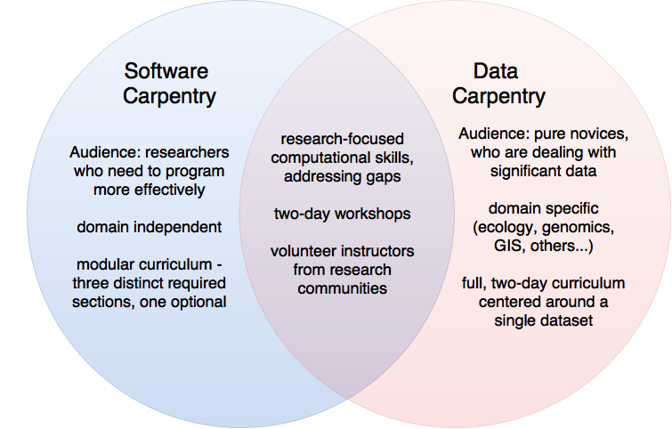

In becoming an instructor for Software or Data Carpentry,
you are also becoming part of a community of like-minded volunteers.
This section provides some background on both organizations,
and on the final steps toward certification.

> ## Preparation and Discussion
>
> This discussion assumes that trainees have read the [operations guide]({{ site.swc_site }}/workshops/operations/)
> (which is [assigned as overnight homework]({{ page.root }}/12-summarize/)).
> Instead of going through this material point by point,
> trainers should ask each trainee to add one non-overlapping question to a list,
> then go through that list.
{: .callout}

## History

[Software Carpentry]({{ site.swc_site }} ) was co-founded in 1998 by Brent Gorda and
Greg Wilson, who identified a need for best practices training in
research computing.  After several iterations, the current model of
two-day workshops with a standard curriculum emerged in 2010-11.
After intermediate support from various organizations, it became an
independent non-profit organization called the [Software Carpentry
Foundation]({{ site.swc_site }}/scf/) (SCF) in 2015.  The SCF is now responsible for all
aspects of Software Carpentry's operations.

> ## History Lesson
>
> For more on Software Carpentry's history,
> and on what we've learned along the way,
> see [this page]({{ site.swc_site }}/scf/history/) on its website
> or the paper "[Software Carpentry: Lessons Learned](http://f1000research.com/articles/3-62/v2)".
{: .callout}

In 2013, members of the Software Carpentry community identified a need
for training aimed at computational novices that would teach
researchers how to properly handle their data.  This led to the
creation of [Data Carpentry]({{ site.dc_site }}) under the leadership of Tracy Teal.
While separate, the two organization share many aspects of their operations,
long-term goals, and community structure:

*   Both focus on computational skills.
*   Both run two-day workshops taught by volunteer instructors.
*   Both strive to fill gaps in current training for researchers.

However, they differ in their content and intended audience.
Data Carpentry workshops focus on best practices surrounding data.
Its learners are not people who want to learn about coding,
but rather those who have a lot of data and don't know what to do with it.
Accordingly, Data Carpentry workshops:

*   are aimed at pure novices,
*   domain-specific, and
*   present a full two-day curriculum centered around a single data set.

Software Carpentry workshops focus on best practices for software development and use.
Its workshops are:

*   intended for people who need to program more effectively to solve their
    computational challenges,
*   not domain-specific, and
*   modular --- each Software Carpentry lesson is standalone.

## Workshop Operations

We have recorded what we've learned about writing workshops
in an [operations guide]({{ site.swc_site }}/workshops/operations/)
and a set of checklists (linked from that page)
that describes what everyone involved in a workshop is expected to do and why.
Questions, corrections, and additions are *very* welcome.

Since January 2015 we have run bi-weekly debriefing sessions
for instructors who have recently taught workshops.
In these,
instructors discuss what they actually did,
how it worked,
how the lessons they actually delivered differed from our templates,
what problems arose,
and how they were addressed.
Summaries are posted on our blog shortly after each meeting,
and eventually added to our operations guide.

> ## How We Do Things
>
> Go to the [operations guide]({{ site.swc_site }}/workshops/operations/)
> and read the instructions for a regular instructor
> and for a workshop host.
> What situations might come up that these *don't* answer?
{: .challenge}

### What Costs What?

Quoting the [Software Carpentry workshop request page]({{ site.swc_site}}/workshops/request/):

> Our instructors are volunteers,
> and so are not paid for their teaching,
> but **host sites are required to cover travel and accommodation costs for any instructors visiting from out of town**.
> The Software Carpentry Foundation offers three fee schedules for workshops:
>
> **Self-Organized Workshops: Optional Donation**
>
> Software Carpentry welcomes you to organize and run your own workshop
> without administrative assistance from the Software Carpentry Foundation by optional donation.
> In order to use the Software Carpentry name and logo at your event,
> we only require that you follow our curriculum,
> have at least one badged instructor teaching and co-organizing your event,
> and let us know that you're organizing a workshop.
> In order to help Software Carpentry continue operating and offering workshops around the world,
> we ask for (but do not require) a donation, and recommend $500 USD as a suitable amount.
>
> **Nonprofit Organization: $2500**
>
> If you are a not-for-profit, such as a university or government lab,
> the Software Carpentry Foundation will organize a workshop for you
> (not including instructor travel and accommodation costs) for $2500 USD.
>
> **For-Profit Institution: $10000**
>
> If you are a for-profit institution, such as a company,
> the Software Carpentry Foundation will organize a workshop for you
> (not including instructor travel and accommodation costs) for $10,000 USD
> of which three quarters is used to underwrite workshops at institutions that could otherwise not afford them.
>
> We strive to be a global project and support diversity in science.
> If you wish to offer a workshop that would further these goals,
> please contact us regarding a waiver for the administration fee at the nonprofit and for-profit scales.
> Waivers are not required for self-organized workshops.
{: .quotation}

Quoting the [Data Carpentry workshops page]({{ site.dc_site}}/workshops-host/):

> The cost of hosting a workshop is both the Workshop Administration Fee and travel expenses for the two instructors.
>
> **Workshop Administration Fee: $2500 US**
>
> This is the fee is for non-profit organizations, such as universities and government labs.
> If you are a for-profit organization, such as a company, and are interested in a workshop, please get in touch.
>
> Partial or full waivers for fees will be considered on an as-needed basis.
>
> **Travel Expenses for Instructors: ~$2000 US**
>
> All instructors are volunteers, but the Host needs to cover their travel expenses.
> We work to find local instructors,
> but suggest that you estimate about $2000 for the travel, food and accommodation of the instructors.
> The details of how you will reimburse the instructors needs to be established when the workshop is scheduled.
{: .quotation}

### Materials

All of Software and Data Carpentry's lessons materials are freely available
under a permissive [open license]({{ page.root }}/license/).
You may use them whenever and however you want,
provided you cite the original source.

> ## What's Core?
>
> Our learners have such a wide spread of prior knowledge
> that no one fixed lesson could possibly fit everyone's needs.
> We have therefore provided more material than most people will get through most of the time
> in order to be (reasonably) sure that we have enough for more advanced classes.
> In particular:
>
> 1. Callouts (like this one) contain material that isn't essential to the lesson,
>    and which most instructors will skip.
> 2. Most instructors only give learners one or two exercises per episode;
>    the other exercises are there for self-study.
{: .callout}

### Using the Names

However, the names "Software Carpentry" and "Data Carpentry"
and their respective logos
are all trademarked.
You may only call a workshop a Software Carpentry or Data Carpentry workshop if:

*   it covers the core topics,
*   at least one instructor is certified,
*   you run our standardized pre- and post-workshop assessments and provides us with the results, and
*   you send us summary information about attendees (at a minimum, the number of people who attended).

### Who Can Teach What

Software Carpentry and Data Carpentry share a single instructor training program,
but instructors must certify separately for each at the end:
see the description of [the instructor checkout procedure]({{ page.root }}/checkout/)
for details.

### Setting Up

In order to communicate with learners,
and to help us keep track of who's taught what and where,
each workshop's instructors create a one-page website using
[this template]({{ site.workshop_template }}).
Once that has been created,
the host or lead instructor sends its URL to
the [workshop coordinator](mailto:{{ site.email }}),
who adds it to our records.
The workshop will show up on our websites shortly thereafter.

> ## Practice With SWC Infrastructure
>
> Go to the [workshop template repository]({{ site.workshop_template }}) and follow the directions
> to create a workshop website using your local location and today's date.
{: .challenge}

We also have [a small installer for Windows](https://github.com/swcarpentry/windows-installer/releases/download/v0.3/SWCarpentryInstaller.exe)
to help people set up their environment,
which is maintained in [this GitHub repository](https://github.com/swcarpentry/windows-installer).
This installer runs *after* the installer that puts Git and Bash on Windows,
and does the following:

*   Installs GNU Make and makes it accessible from msysGit
*   Installs nano and makes it accessible from msysGit
*   Installs SQLite and makes it accessible from msysGit
*   Creates a ~/nano.rc with links to syntax highlighting configurations
*   Provides standard nosetests behavior for msysGit
*   Adds R's bin directory to the path (if we can find it)

Please see the setup instructions in the workshop template for more details.

## The Carpentry Community

There are several hubs of activity for the Software and Data Carpentry communities:

*   Our websites are:
    *   [Software Carpentry]({{ site.swc_site }})
        *   [Blog]({{ site.swc_site }}/blog/)
        *   [Get Involved]({{ site.swc_site }}/join/)
    *   [Data Carpentry]({{ site.dc_site }})
        *   [Blog]({{ site.dc_site }}/blog/)
        *   [Get Involved]({{ site.dc_site }}/involved/)
*   Our lessons are hosted on GitHub;
    contributions to them and discussion of changes happens via GitHub pull requests and issues,
    and the lessons are published using GitHub Pages.
    More details are given below.
    *   [Data Carpentry on GitHub]({{ site.dc_github }})
    *   [Software Carpentry on GitHub]({{ site.swc_github }})
*   Both Software and Data Carpentry have public discussion lists
    that host everything from lively discussion on teaching practices
    to job postings and general announcements.
*   Data Carpentry also has a [discussion forum](http://discuss.datacarpentry.org/)
*   And you can find us on Twitter:
    *   [Software Carpentry on Twitter](https://twitter.com/swcarpentry)
    *   [Data Carpentry on Twitter](https://twitter.com/datacarpentry)

> ## Get Connected
>
> Join our discussion lists, subscribe to our blogs, and follow us on Twitter.
{: .challenge}

### A Culture of Contribution

The administration, policies, practices and content of
Software Carpentry and Data Carpentry rest on the shoulders of the
communities that support them.  In the same way that we hope to promote a
culture of openness, sharing,
and reproducibility in science and research through training researchers with
the tools they need, the
Carpentry organizations themselves aim to be open, collaborative, and
based on best practices.  Just
as we encourage researchers to use packages and modules in their code, to
create re-usable pieces, we want to draw together the collective expertise of
our teaching community to create collaborative lessons, share other materials,
and improve the lessons via "bug fixes" as we go along.

### Lesson Contribution

The lesson materials for Software and Data Carpentry
are hosted on GitHub:

*   [Data Carpentry on GitHub]({{ site.dc_github }})
*   [Software Carpentry on GitHub]({{ site.swc_github }})

and are developed collaboratively---in 2015 alone, almost 200 people
made contributions to various lessons.  Each lesson is in a separate
repository, and consists of narrative lesson material and an
associated directory containing the data or scripts needed in the
lesson.  This source material is also then served as a website, using
GitHub's "gh-pages" feature.

Lesson contribution is managed within the repository using "issues"
and "pull requests".  New problems or suggestions can be introduced
as issues, discussed by the community, and addressed via a pull
request, which serves as a "request" to make changes, and can also
be discussed before changes are merged.  

### Lesson Incubation

Maybe this instructor training has inspired you to go home and write your 
own fantastic lesson!  If you'd like to model it after the Software and 
Data Carpentry lesson format, you can go to [this repository]({{ site.example_repo }}) for 
a template and instructions.  

Writing a new lesson can be a lot of work.  While some people have written 
new lessons on their own, other people have asked people in the community to 
help them.  If you think there are other people who would be interested in 
your lesson idea, you can email the Software and Data Carpentry discussion 
lists to find out if anyone is interested.  If so, one person will typically
take the lead and be the lesson's director and maintainer until it's ready to 
be taught.  

> ## Many Ways to Contribute
> 
> We recognize that the medium of GitHub may be restrictive to those
> who wish to contribute to our lessons.  We are always searching for
> ways to make the process more friendly to all, whether that be
> contribution training, or alternative routes to contribution.  If you
> have any ideas how we might make contribution more contributor-friendly,
> please let us know.
{: .callout}

### Beyond Lessons

While contribution is frequently seen in terms of contributing
to specific lessons in either organization, there
are many, many ways to contribute and participate in the Software and Data
Carpentry communities.

* Contributing to discussion and development of lessons and policies, via
discussions on Github issues/pull requests or email discuss lists
* Writing blog posts and bringing important ideas/news to the community
* Developing tools
* Hosting and organizing workshops
* Contributing to lessons via raising issues or submitting pull requests
* Leadership and administrative positions, including being a lesson maintainer,
 or serving on a committee.

Here are some examples of ways that people have contributed to the community:

  * [This email thread](http://lists.software-carpentry.org/pipermail/discuss/2015-October/003396.html)
is a good example of many instructors chiming in on a topic, resulting in a
[blog post](http://software-carpentry.org/blog/2015/10/pulling-along-those-behind.html),
summarizing the discussion.
  * [Discussion on a significant pull request](https://github.com/swcarpentry/r-novice-gapminder/pull/89)

So being part of a friendly, open discussion, is of equal or greater importance
to the community than submitting the perfect lesson change.  The
[checkout process]({{ page.root }}/checkout/) to become a fully-fledged instructor will be
one way to start connecting to the community and find which area will allow you
to contribute best.

### Governance

Software Carpentry is a democracy:
its seven-member [Steering Committee]({{ site.swc_site }}/scf/ ) is elected annually
by and from its membership,
which includes every instructor who has taught in the two years leading up to the election.
The Steering Committee has final say on all strategic and financial decisions;
if you would like Software Carpentry to take a new direction,
or would like to do more than teach or develop lessons,
you are very welcome to put your name forward as a candidate.

> ## Feedback on Assessment
>
> Go through the pre-assessment questionnaire given to you by your instructor
> and critique its questions.
> (Remember, critiquing means commenting on positive aspects as well as negative ones.)
> How long do you think it will take the average learner to fill it in?
> How useful do you think the information it gathers will be to you as an instructor?
> How could you improve the questions?
> What would you add, and what would you drop to make room?
{: .challenge}
